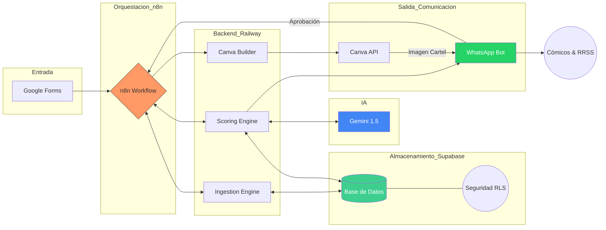

# AI LineUp Architect (MVP) 🎭

**Estado del Proyecto:** 🛠️ En Desarrollo (MVP)  
**Versión:** 0.4.2  
**Metodología:** Spec-Driven Development (SDD)

Sistema automatizado para la gestión y generación de lineups y cartelería para Open Mics de comedia.

El proyecto nace con una arquitectura **SaaS-Ready**, garantizando la privacidad de los datos entre diferentes productores mediante un modelo de datos maestro/detalle y políticas de seguridad avanzadas.

## 📝 Visión del Proyecto
El objetivo de este MVP es automatizar el ciclo de vida semanal de un Open Mic, reduciendo la carga administrativa del organizador y utilizando IA para optimizar la selección de cómicos y la creación de activos visuales.

## 🌳 Estrategia de Ramas (Git Flow)

Para mantener la estabilidad del proyecto, seguimos una estructura de ramificación sencilla pero rigurosa:

* **`main`**: Contiene exclusivamente código estable, probado y listo para producción (versiones cerradas).
* **`dev`**: Rama principal de desarrollo. Todas las nuevas funcionalidades, correcciones y experimentos se integran aquí antes de pasar a `main`.

> **Regla de oro:** Nunca se realizan commits directos en `main`. Todo cambio debe pasar primero por `dev` y ser validado.


## 🔄 Flujo de Trabajo (Lifecycle)
1. **Ingesta:** Procesamiento de solicitudes recibidas a través de Google Forms.
2. **Curación:** Selección asistida por IA del lineup semanal basada en el historial y criterios de puntuación.
3. **Generación:** Creación automática del cartel del evento en Canva mediante su API.
4. **Histórico:** Actualización automática de la base de datos tras la validación del host.



## 🧱 Stack Tecnológico e Infraestructura (MVP Actual)

### 🖥️ Servidor y Despliegue (Self-Hosted)

| Componente | Implementación | Rol en el sistema |
|---|---|---|
| 🌐 VPS | Servidor propio vinculado al dominio **machango.org** | Punto central de ejecución y exposición de servicios del MVP. |
| 🧊 Coolify | Gestor de aplicaciones y contenedores | Estandariza despliegues, reinicios, variables de entorno y operación continua. |
| 🔄 n8n | Instalado en el VPS (nativo/contenedor) | Orquestación event-driven de flujos, webhooks y automatizaciones en tiempo real. |

### 🗄️ Base de Datos (Cloud)

| Capa | Tecnología | Propósito |
|---|---|---|
| 🥉 Bronze | Supabase PostgreSQL (`bronze.solicitudes`) | Almacenamiento RAW e inmutable de ingesta (trazabilidad total). |
| 🥈 Silver | Supabase PostgreSQL (`silver.*`) | Datos normalizados y relacionales para operación, scoring y reporting. |

> Supabase se mantiene como motor principal PostgreSQL en la nube, mientras la lógica operativa del MVP vive en infraestructura self-hosted.

### 🔌 Herramientas Externas e Integraciones

- ☁️ **Google Cloud Platform (OAuth2):** autenticación y permisos para integración con **Google Sheets** y **Google Drive**.
- 🐍 **Python 3.10+:** ejecución de los motores de **ingesta, limpieza y scoring** de negocio.
- 🧠 **OpenAI API (Preparado):** capa lista para curación y validación de lenguaje natural en comentarios/contexto.
- 🎨 **Canva API:** generación automatizada del cartel final cuando el estado del lineup queda aprobado.

### 🔁 Flujo de Datos (Resumen Operativo)

1. 📥 Una nueva fila o evento en **Google Sheets** dispara un trigger en **n8n**.
2. ⚙️ **n8n**, ejecutándose en el VPS bajo la operación de **Coolify**, activa el script local de **Python**.
3. 🥉 El script persiste la entrada RAW en **Bronze** y aplica normalización/reglas de negocio.
4. 🥈 Los datos curados se escriben en **Silver** para scoring, decisiones y trazabilidad transaccional.
5. 📤 El flujo continúa con notificaciones/acciones posteriores (aprobación host, generación de cartel y distribución).

## 🚀 Objetivos del MVP
- Mantener ingesta cruda en `bronze.solicitudes` y curación transaccional en `silver`.
- Automatizar el cálculo de puntos (tiempo desde la última actuación, paridad, prioridad).
- Generar el póster final sin intervención manual en el diseño.
- Mantener un registro histórico fiable de quién actúa en cada show.

## 🛠️ Herramientas de Infraestructura (Novedad)
Para mantener la integridad de la base de datos en Supabase, el proyecto incluye:
- **`setup_db.py`**: Script de automatización que gestiona:
    - **Backup Preventivo:** Exportación a CSV en `/backups` antes de cualquier cambio destructivo.
    - **Evolución de Esquema:** Ejecución secuencial de SQL por capas (`bronze` -> `silver` -> migraciones).
    - **Seeding:** Inyección de datos de prueba alineados al linaje `bronze -> silver`.

## 🗃️ Modelo de Datos (Bronze/Silver)
- **`bronze.solicitudes`**:
  - Única tabla en Bronze.
  - Conserva campos crudos del formulario (`*_raw`) y `raw_data_extra` (`jsonb`).
- **`silver.comicos`**:
  - Maestro de identidad única por `instagram_user` normalizado (minúsculas y sin `@`).
- **`silver.proveedores`**:
  - Maestro de Open Mics / organizadores.
- **`silver.solicitudes`**:
  - Tabla transaccional con FKs a `silver.comicos` y `silver.proveedores`.
  - Trazabilidad obligatoria mediante `bronze_id` (`FK -> bronze.solicitudes(id)`).
- **Tipos y seguridad**:
  - Enums en `silver`: `silver.tipo_categoria`, `silver.tipo_status`.
  - RLS habilitado en Bronze y Silver para `service_role`.

## ⚙️ Operación Local (DB)
1. Configura `DATABASE_URL` en `.env`.
2. Aplica esquema:
   - `python setup_db.py`
3. Aplica esquema + datos de prueba:
   - `python setup_db.py --seed`
4. Reset controlado + backup + seed:
   - `python setup_db.py --reset --seed`

## 🔁 Flujo de Ingesta Bronze -> Silver
El ingestion engine (`backend/src/bronze_to_silver_ingestion.py`) prepara el linaje operativo:
1. Lee registros pendientes en `bronze.solicitudes`.
2. Normaliza `instagram_raw`.
3. Hace upsert en `silver.comicos`.
4. Inserta en `silver.solicitudes` con `bronze_id`, `comico_id` y `proveedor_id`.

## 🏗️ Estructura del Proyecto (Refactorizada)
```text
/
├── backend/              # Lógica de negocio en Python
│   └── src/              # Ingestion, Scoring y Canva Builder
├── backups/              # Volcados temporales de seguridad (Local CSV) [GIT IGNORED]
├── specs/                # Fuente de verdad (Source of Truth)
│   └── sql/              # Esquemas, Migraciones y Seed Data
├── workflows/            # Planos de automatización (n8n)
├── .env                  # Variables críticas (DB_URL, Drive_ID, etc.)
├── setup_db.py           # Herramienta de despliegue, reset y backups de BD
├── package.json          # Versión del proyecto (SemVer)
└── README.md             # Esta documentación
```

---
*Este proyecto se desarrolla con un enfoque progresivo, priorizando la automatización del flujo crítico antes de añadir capas de complejidad adicional.*
