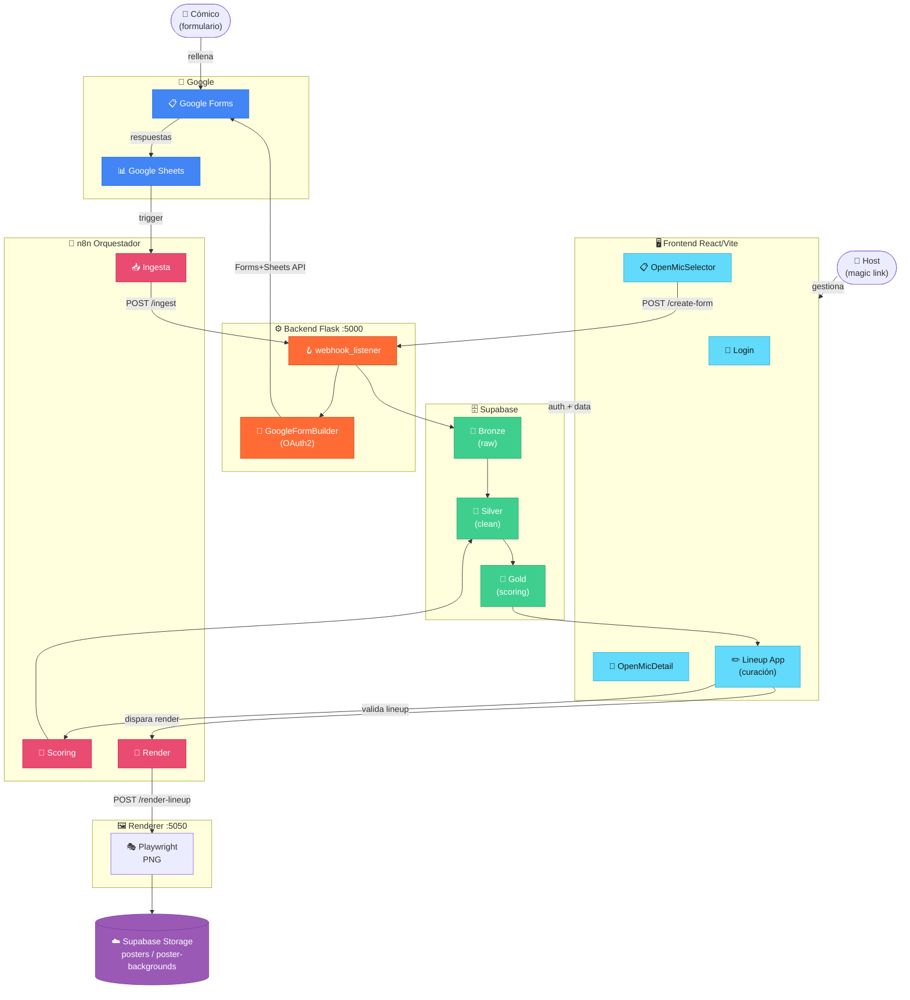

# AI LineUp Architect

**Estado:** En desarrollo activo
**Versión:** `0.7.0`
**Metodología:** Spec-Driven Development (SDD) + TDD

SaaS multi-tenant para gestión de open mics de comedia. Automatiza la recogida de solicitudes de cómicos (Google Forms), el scoring y la selección del lineup, y la generación del cartel en PNG.

---

## Arquitectura



→ Detalle de capas y variables de entorno: [`docs/architecture.md`](docs/architecture.md)

---

## Stack

| Capa | Tecnología |
|------|-----------|
| Frontend | React + Vite + Tailwind |
| Backend | Python / Flask |
| Base de datos | Supabase (PostgreSQL — Bronze/Silver/Gold) |
| Almacenamiento | Supabase Storage |
| Auth | Supabase (magic link) |
| Orquestación | n8n |
| Formularios | Google Forms + Sheets API (OAuth2) |
| Render de carteles | Playwright + Jinja2 |
| Procesos en producción | PM2 en VPS Ubuntu |

---

## Estructura del repositorio

```
recova-project/
├── backend/
│   ├── scripts/              # Utilidades de setup (OAuth2, etc.)
│   ├── src/
│   │   ├── core/             # Módulos: scoring, render, forms, security
│   │   ├── triggers/         # webhook_listener.py (Flask :5000)
│   │   ├── templates/        # Plantillas HTML para render de carteles
│   │   ├── bronze_to_silver_ingestion.py
│   │   ├── scoring_engine.py
│   │   └── mcp_server.py     # Renderer API (Flask :5050)
│   └── tests/
│       ├── core/             # Tests unitarios de módulos core
│       ├── unit/             # Tests unitarios generales
│       └── mcp/              # Tests del renderer
├── frontend/
│   └── src/
│       ├── components/       # OpenMicSelector, OpenMicDetail, ScoringConfigurator...
│       ├── App.jsx           # Lineup app (curación)
│       └── main.jsx          # Root: Login → Selector → Detail → App
├── specs/                    # Specs SDD activas
│   ├── google_form_autocreation_spec.md
│   ├── google_form_campos_spec.md
│   └── sql/                  # Esquemas y migraciones SQL
├── docs/                     # Documentación técnica
│   ├── architecture.md
│   ├── sprints.md
│   └── setup.md
├── workflows/
│   └── n8n/                  # Workflows exportados de n8n
├── CHANGELOG.md
└── pyproject.toml
```

---

## Inicio rápido

→ Instrucciones completas: [`docs/setup.md`](docs/setup.md)

```bash
# Backend
cd backend && python3 -m venv venv && source venv/bin/activate
pip install python-dotenv flask flask-cors supabase google-api-python-client google-auth
# Configurar backend/.env (ver docs/setup.md)
cd .. && PYTHONPATH=. python backend/src/triggers/webhook_listener.py

# Frontend
cd frontend && npm install && npm run dev
```

---

## Sprints

→ Historial completo: [`docs/sprints.md`](docs/sprints.md)

| Fase | Versión | Estado |
|------|---------|--------|
| Sprint 2 — Google Forms + Backend integration | 0.7.0 | Completado |
| Sprint 1 — Pivot SaaS Multi-Tenant | 0.6.0 | Completado |
| SVG Renderer | 0.5.57–0.5.61 | Completado |
| MCP Renderer + Frontend UI | 0.5.33–0.5.56 | Completado |
| Playwright Renderer v1 | 0.5.25–0.5.32 | Completado |
| Canva Integration *(deprecada)* | 0.5.16–0.5.24 | Completado |
| Pipeline Inicial + Gold Layer | 0.5.0–0.5.15 | Completado |
| Ingesta + Infraestructura | 0.4.x | Completado |
| Bronze + Silver + Seed | 0.1.0–0.3.0 | Completado |

**Próximo:**
- `confirm_lineup()` RPC → `silver.lineup_slots`
- Renderer lee `config.poster.base_image_url`
- Deploy frontend en producción

---

## Tests

```bash
source backend/venv/bin/activate
PYTHONPATH=. pytest backend/tests/ -v
```

Cobertura actual: scoring config (27), google form builder (23), data binder, security, render, MCP.

---

## Documentación

| Documento | Descripción |
|-----------|-------------|
| [`docs/architecture.md`](docs/architecture.md) | Diagrama de sistema y variables de entorno |
| [`docs/sprints.md`](docs/sprints.md) | Historial de sprints y pendientes |
| [`docs/setup.md`](docs/setup.md) | Setup local y producción |
| [`specs/google_form_autocreation_spec.md`](specs/google_form_autocreation_spec.md) | Spec auto-creación Google Forms |
| [`CHANGELOG.md`](CHANGELOG.md) | Historial de versiones |
