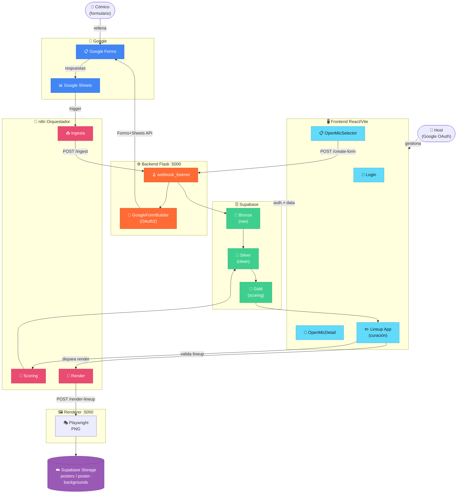

# AI LineUp Architect

**Estado:** En desarrollo activo
**Versión:** `0.17.1`
**Metodología:** Spec-Driven Development (SDD) + TDD

SaaS multi-tenant para gestión de open mics de comedia. Automatiza la recogida de solicitudes de cómicos (Google Forms), el scoring y la selección del lineup, y la generación del cartel en PNG.

---

## Arquitectura



→ Detalle de capas y variables de entorno: [`docs/architecture.md`](docs/architecture.md)

---

## Stack

| Capa | Tecnología |
|------|-----------|
| Frontend | React + Vite + Tailwind |
| Backend | Python / Flask |
| Base de datos | Supabase (PostgreSQL — Bronze/Silver/Gold) |
| Almacenamiento | Supabase Storage |
| Auth | Supabase (Google OAuth — registro abierto) |
| Orquestación | n8n |
| Formularios | Google Forms + Sheets API (OAuth2) |
| Render de carteles | Playwright + Jinja2 |
| Procesos en producción | PM2 en VPS Ubuntu (Hetzner) |
| Proxy / HTTPS | Traefik vía Coolify — `api.machango.org` |
| Bot Telegram | `@ailineup_bot` (n8n + Gemini 2.5 Flash) |

---

## Estructura del repositorio

```
recova-project/
├── backend/
│   ├── scripts/              # Utilidades: OAuth2, seed condicional, seed completo, reset
│   ├── src/
│   │   ├── core/             # Módulos: scoring, render, forms, security
│   │   ├── triggers/         # webhook_listener.py (Flask :5000)
│   │   ├── templates/        # Plantillas HTML para render de carteles
│   │   ├── bronze_to_silver_ingestion.py
│   │   ├── scoring_engine.py
│   │   └── mcp_server.py     # Renderer API (Flask :5050)
│   └── tests/
│       ├── core/             # Tests unitarios de módulos core
│       ├── scripts/          # Tests de scripts de utilidad
│       ├── unit/             # Tests unitarios generales
│       └── mcp/              # Tests del renderer
├── frontend/
│   └── src/
│       ├── components/       # OpenMicSelector, OpenMicDetail, ScoringConfigurator...
│       ├── App.jsx           # Lineup app (curación)
│       └── main.jsx          # Root: Login → Selector → Detail → App
├── specs/                    # Specs SDD activas
│   ├── google_form_autocreation_spec.md
│   ├── google_form_campos_spec.md
│   └── sql/                  # Esquemas y migraciones SQL
├── docs/                     # Documentación técnica
│   ├── architecture.md
│   ├── sprints.md
│   └── setup.md
├── workflows/
│   └── n8n/                  # Workflows exportados de n8n
├── CHANGELOG.md
└── pyproject.toml
```

---

## Inicio rápido

→ Instrucciones completas: [`docs/setup.md`](docs/setup.md)

```bash
# Backend
cd backend && python3 -m venv venv && source venv/bin/activate
pip install python-dotenv flask flask-cors supabase google-api-python-client google-auth
# Configurar backend/.env (ver docs/setup.md)
cd .. && PYTHONPATH=. python backend/src/triggers/webhook_listener.py

# Frontend
cd frontend && npm install && npm run dev
```

---

## Sprints

→ Historial completo: [`docs/sprints.md`](docs/sprints.md)

| Fase | Versión | Estado |
|------|---------|--------|
| Sprint 10 — Scoring Inteligente Custom | 0.15.0 | Completado |
| Sprint 9 — Smart Form Ingestion | 0.14.0 | Completado |
| Sprint 8 — Google OAuth Open Registration | 0.13.0 | Completado |
| Sprint 7 — Poster Renderer (Gemini Flash Vision) | 0.12.0 | Completado |
| Sprint 6 — Ingesta Multi-Tenant + Scripts de Utilidad | 0.11.0 | Completado |
| Sprint 5 — Validación de Lineup via Telegram | 0.10.0 | Completado |
| Sprint 4b — Telegram Register Endpoint | 0.9.1 | Completado |
| Sprint 4a — Telegram QR Self-Registration | 0.9.0 | Completado |
| Sprint 3 — Telegram Lineup Agent (LLM + MCP) | 0.8.0 | Completado |
| Sprint 2 — Google Forms + Backend integration | 0.7.0 | Completado |
| Sprint 1 — Pivot SaaS Multi-Tenant | 0.6.0 | Completado |

**Roadmap:**
- Conectar renderer al flujo: n8n → `POST /api/render-poster` → Supabase Storage → Telegram
- Activar `Scoring & Draft` e `Ingesta-Solicitudes` en n8n producción
- Endpoint `POST /api/ingest-from-forms` para ingesta diaria via n8n (sin Sheets)
- Penalización recencia en `scoring_engine.py`

---

## Scoring Inteligente (Sprint 9 + 10 — implementado)

El sistema de scoring se adapta a cualquier formulario Google Forms sin forzar nombres de campo fijos.

### Selección de tipo de scoring

```
[ Sin scoring    ]  orden de llegada, sin algoritmo
[ Scoring básico ]  VIP, género, recencia, fecha única...
[ Scoring custom ]  reglas emergentes de tu formulario (con IA)
```

### Scoring básico — Smart Field Mapping
Gemini mapea los campos del form al schema canónico automáticamente.

```
"Como te llamas?"   → nombre_artistico
"IG handle?"        → instagram
"¿Estarías de back?"→ backup
"¿Haces humor negro?"→ sin mapeo → metadata (campo custom para scoring custom)
```

### Scoring custom — Reglas propuestas por IA
Gemini lee los campos no mapeados y propone reglas. El host activa/desactiva y ajusta el peso con un slider.

```
"¿haces humor negro?"  → +20 pts si = "Sí"   [toggle ON]  [slider]
"¿eres de aquí?"       → +15 pts si = "Sí"   [toggle ON]  [slider]
"¿primera vez?"        → +10 pts si = "Sí"   [toggle OFF] [slider]
```

### Schema en `silver.open_mics.config`

```json
{
  "scoring_type": "basic | custom | none",
  "field_mapping": { "Como te llamas?": "nombre_artistico" },
  "custom_scoring_rules": [
    { "field": "haces humor negro?", "condition": "equals",
      "value": "Sí", "points": 20, "enabled": true }
  ]
}
```

---

## Tests

```bash
source backend/venv/bin/activate
PYTHONPATH=. pytest backend/tests/ -v
```

Cobertura actual: ~268 tests verdes — scoring config (basic + custom), custom scoring proposer, google form builder, form ingestor, form analyzer, sheet ingestor, form submission, ingest-from-sheets, validate lineup, telegram register/QR, scripts de utilidad + 20 tests frontend (formUtils, ScoringTypeSelector, CustomScoringConfigurator).

---

## Documentación

| Documento | Descripción |
|-----------|-------------|
| [`docs/architecture.md`](docs/architecture.md) | Diagrama de sistema y variables de entorno |
| [`docs/sprints.md`](docs/sprints.md) | Historial de sprints y pendientes |
| [`docs/setup.md`](docs/setup.md) | Setup local y producción |
| [`specs/google_form_autocreation_spec.md`](specs/google_form_autocreation_spec.md) | Spec auto-creación Google Forms |
| [`CHANGELOG.md`](CHANGELOG.md) | Historial de versiones |
