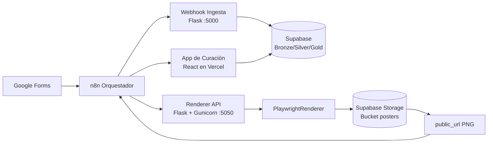

# AI LineUp Architect 🎭

**Estado del Proyecto:** 🛠️ En desarrollo activo
**Versión:** `0.5.33`
**Metodología:** Spec-Driven Development (SDD)

Sistema para ingesta, curación y generación automática de cartel de Open Mics, con trazabilidad completa desde formularios hasta artefacto final publicado.

## 1. Fuente de verdad técnica (v0.5.33)

En esta versión se consolidan los siguientes cambios estructurales:

- **Nueva capa MCP Agnostic Renderer (spec-first):** se define el contrato agnóstico de entrada/salida, trazabilidad y modos `template_catalog`/`vision_generated` en `specs/mcp_agnostic_renderer_spec.md` como Fuente de Verdad previa a implementación.
- **Hardening de workflows n8n:** `workflows/n8n/LineUp.json` elimina credenciales/hosts hardcodeados y usa variables de entorno (`$env`) para Supabase y renderer.
- **Nueva variable de entorno para render en n8n:** `N8N_BACKEND_RENDER_URL` documentada en `.env.example`.
- **Deprecación de Canva:** la integración con Canva API queda retirada del flujo productivo.
- **Motor de diseño propio:** el render final se realiza con `PlaywrightRenderer`.
- **Desacople por puertos (SDD):**
  - **Webhook Ingesta (Flask):** `:5000`
  - **Renderer API (Flask + Gunicorn):** `:5050`
- **Infraestructura objetivo:** ejecución directa en **VPS Ubuntu** con **PM2** para persistencia de procesos.
- **Salida de render:** PNG subido al bucket `posters` de Supabase Storage, devolviendo `public_url`.

## 2. Arquitectura de sistema



## 3. Stack tecnológico e infraestructura

| Capa | Tecnología | Rol en el sistema |
|---|---|---|
| Hosting | VPS Ubuntu | Entorno principal de ejecución en producción. |
| Orquestación | n8n | Coordinación de flujos (ingesta, validación y render). |
| Ingesta API | Flask (`backend/src/webhook_listener.py`) | Endpoint webhook para normalización y paso Bronze → Silver en `:5000`. |
| Render API | Flask + Gunicorn (`backend/src/app.py`) | Endpoint `POST /render-lineup` en `:5050`. |
| Motor de Cartelería | Playwright + Jinja2 (`PlaywrightRenderer`) | Generación del PNG final en runtime local. |
| Persistencia de procesos | PM2 | Gestión de procesos `webhook-ingesta` y `recova-renderer`. |
| Base de datos | Supabase PostgreSQL | Capas `bronze`, `silver`, `gold` para trazabilidad y scoring. |
| Almacenamiento de artefactos | Supabase Storage (`posters`) | Hosting del cartel final y emisión de `public_url`. |
| Curación operativa | React en Vercel | Validación manual del lineup antes de render final. |

## 4. APIs de producción

### 4.1 Webhook de ingesta (`:5000`)

- Endpoint principal de disparo:
  - `POST /ingest`
- Uso típico:
  - n8n recibe trigger y envía payload al webhook.
  - El servicio procesa reglas de normalización y persiste en Supabase.

Ejemplo local:

```bash
curl -X POST http://localhost:5000/ingest \
  -H "Content-Type: application/json" \
  -d '{"trigger":"n8n"}'
```

### 4.2 Renderer API (`:5050`)

- Endpoint productivo:
  - `POST /render-lineup`
- Contrato:
  - Valida payload según spec SDD de renderer.
  - Renderiza PNG con `PlaywrightRenderer`.
  - Sube archivo a Supabase Storage (`posters`).
  - Responde con `public_url` y metadatos del render.

#### Ejecución recomendada con Gunicorn (producción)

```bash
./.venv/bin/gunicorn -w 4 -b 0.0.0.0:5050 backend.src.app:app
```

#### Gestión con PM2

```bash
pm2 start "./.venv/bin/gunicorn -w 4 -b 0.0.0.0:5050 backend.src.app:app" --name recova-renderer
pm2 start "./.venv/bin/python backend/src/webhook_listener.py" --name webhook-ingesta
```

## 5. Almacenamiento de carteles (Supabase Storage)

Flujo de salida de cartelería:

1. Renderer genera PNG temporal local.
2. El archivo se sube al bucket `posters`.
3. Se publica URL accesible (`public_url`).
4. Se elimina el temporal local tras upload exitoso.

Ruta lógica esperada del archivo:

- `YYYY-MM-DD/lineup_{request_id}.png`

## 6. Modelo de datos y pipeline

- **Bronze:** ingesta cruda de formularios.
- **Silver:** datos normalizados y consistentes para operación.
- **Gold:** capa de scoring/histórico para selección de lineup.

Resumen del pipeline:

1. n8n recibe trigger externo.
2. n8n invoca Webhook Ingesta (`:5000`).
3. La curación operativa se realiza desde la app React en Vercel.
4. n8n solicita render final a Renderer API (`:5050`).
5. El PNG queda en `posters` y se devuelve `public_url`.

## 7. Operación y desarrollo

### 7.1 Preparación

```bash
python3 -m venv .venv
source .venv/bin/activate
pip install -r requirements.txt
playwright install chromium
playwright install-deps
```

> Nota VPS/producción: instalar Chromium y dependencias del sistema evita el fallback local de render y mejora la trazabilidad de errores reales de arranque del navegador.

### 7.2 Base de datos (setup)

```bash
./.venv/bin/python setup_db.py
./.venv/bin/python setup_db.py --seed
./.venv/bin/python setup_db.py --reset --seed
```

### 7.3 Tests

```bash
./.venv/bin/python -m pytest -q
./.venv/bin/python -m pytest -q backend/tests/unit
./.venv/bin/python -m pytest -q backend/tests/integration
```

## 8. Estructura del repositorio (alto nivel)

```text
backend/
  src/
    app.py
    webhook_listener.py
    playwright_renderer.py
    templates/
  tests/
frontend/
workflows/n8n/
specs/
docs/
```

## 9. Referencias internas recomendadas

- `specs/playwright_renderer_spec.md`
- `docs/render-api-produccion.md`
- `docs/webhook-listener-n8n-ingesta.md`
- `docs/tests-backend.md`

---

Este README define el estado operativo objetivo de la versión `0.5.33` y debe tratarse como referencia principal para decisiones de implementación y despliegue.
