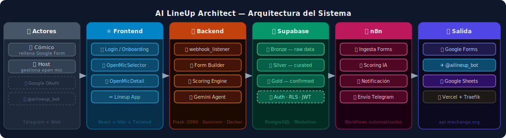
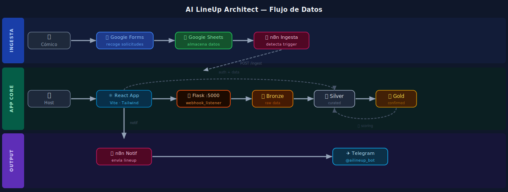

# AI LineUp Architect

**Versión:** `0.21.1` · **Estado:** Desarrollo activo · **Metodología:** SDD + TDD

SaaS multi-tenant para gestión de open mics de comedia. Automatiza la recogida de solicitudes (Google Forms), el scoring con IA y la notificación del lineup por Telegram.

---

## Arquitectura





---

## Stack

| Capa | Tecnología |
|------|-----------|
| Frontend | React + Vite + Tailwind |
| Backend | Python / Flask :5000 |
| Renderer | mcp_server.py — FastAPI :5050 (Gemini Vision + Pillow) · *desactivado temporalmente* |
| Base de datos | Supabase (PostgreSQL — Bronze / Silver / Gold) |
| Auth | Supabase (Google OAuth) |
| Orquestación | n8n |
| Formularios | Google Forms + Sheets API (OAuth2) |
| Procesos | PM2 en VPS Ubuntu (Hetzner) · Traefik — `api.machango.org` |
| Bot Telegram | `@ailineup_bot` (n8n + Gemini 2.5 Flash) |

---

## Estructura

```
recova-project/
├── backend/
│   ├── assets/               # Fuentes y posters base (Pillow)
│   ├── scripts/              # OAuth2, seed, reset
│   ├── src/
│   │   ├── core/             # Módulos: scoring, render, forms, security
│   │   ├── triggers/         # webhook_listener.py (Flask :5000)
│   │   ├── bronze_to_silver_ingestion.py
│   │   ├── scoring_engine.py
│   │   └── mcp_server.py     # Renderer API (FastAPI :5050)
│   └── tests/
│       ├── core/             # Tests módulos core
│       ├── mcp/              # Tests renderer
│       ├── scripts/          # Tests scripts utilidad
│       └── unit/             # Tests unitarios generales
├── frontend/
│   └── src/
│       ├── components/       # OpenMicSelector, OpenMicDetail, ScoringConfigurator…
│       ├── App.jsx           # Lineup app (curación)
│       └── main.jsx          # Root: Login → Selector → Detail → App
├── specs/                    # Specs SDD + esquemas y migraciones SQL
├── docs/                     # Documentación técnica
├── workflows/n8n/            # Workflows exportados
└── CHANGELOG.md
```

---

## Inicio rápido

```bash
# Backend
pip install -r requirements.txt
PYTHONPATH=. python backend/src/triggers/webhook_listener.py   # Flask :5000
PYTHONPATH=. python -m backend.src.mcp_server                  # Renderer :5050

# Frontend
cd frontend && npm install && npm run dev
```

Variables de entorno: [`docs/setup.md`](docs/setup.md)

---

## Tests

```bash
source backend/venv/bin/activate
PYTHONPATH=. pytest backend/tests/unit/ backend/tests/core/   # 189 tests backend
cd frontend && npm test                                        # 40 tests frontend
```

---

## Documentación

| Documento | Descripción |
|-----------|-------------|
| [`docs/architecture.md`](docs/architecture.md) | Variables de entorno y capas |
| [`docs/setup.md`](docs/setup.md) | Setup local y producción |
| [`docs/sprints.md`](docs/sprints.md) | Historial de sprints y roadmap |
| [`CHANGELOG.md`](CHANGELOG.md) | Historial de versiones |

---

## Deuda técnica — Sprints de mejora

Revisión técnica exhaustiva (2026-03-16). Puntuación actual: **7/10** → objetivo **9/10**.

### 🔴 Sprint A — Bugs funcionales (crítico)

| ID | Archivo | Descripción |
|----|---------|-------------|
| ~~A1~~ | ~~`scoring_engine.py:465`~~ | ~~`gender_parity_enabled` flag ignorado en `build_ranking()` — la alternancia f/nb ↔ m se aplica siempre~~ ✅ |
| A2 | `scoring_config.py:21` | `_SINGLE_DATE_BONUS = 40` hardcodeado — no configurable por el host, rompe jerarquía de categorías |

### 🟠 Sprint B — Seguridad

| ID | Archivo | Descripción |
|----|---------|-------------|
| B1 | `.env` / git history | Rotar `WEBHOOK_API_KEY` y `SUPABASE_SERVICE_KEY` antes de publicar el repo |
| B2 | `webhook_listener.py:34` | `Access-Control-Allow-Origin: *` → restringir al dominio de Vercel |
| B3 | `webhook_listener.py:76` | `create_client` instanciado en cada request → singleton a nivel de módulo |

### 🟡 Sprint C — Arquitectura

| ID | Archivo | Descripción |
|----|---------|-------------|
| C1 | `webhook_listener.py` | God File 1.194 líneas → dividir en blueprints Flask por dominio |
| C2 | `webhook_listener.py:92` | `subprocess.run()` síncrono para scoring/ingest → llamada directa a función |
| C3 | `docs/architecture.md` | Documentar decisión Flask (WSGI) vs FastAPI (ASGI/MCP) |

### 🔵 Sprint D — Calidad y argumentación

| ID | Archivo | Descripción |
|----|---------|-------------|
| D1 | `bronze_to_silver_ingestion.py` | Documentar limitaciones de `gender-guesser` (accuracy, casos None, corrección manual) |
| D2 | `App.jsx` | `isValidated` desde `localStorage` → verificar contra `silver.lineup_slots` al cargar |
| D3 | `OnboardingTutorial.jsx` | Tutorial UX bloqueante → modal de confirmación en lugar de bloqueo total |
| D4 | `ecosystem.config.js` | Rutas absolutas hardcodeadas → variables de entorno / separar config local y producción |
