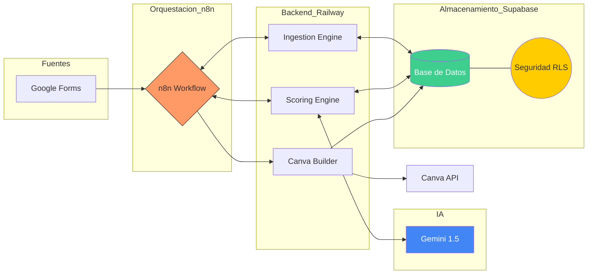

# AI LineUp Architect (MVP) 🎭

**Estado del Proyecto:** 🛠️ En Desarrollo (Fase de Cimentación)  
**Versión:** 0.1.0-alpha  
**Metodología:** Spec-Driven Development (SDD)

Sistema automatizado para la gestión y generación de lineups y cartelería para Open Mics de comedia.

El proyecto nace con una arquitectura **SaaS-Ready**, garantizando la privacidad de los datos entre diferentes productores mediante un modelo de datos maestro/detalle y políticas de seguridad avanzadas.

## 📝 Visión del Proyecto
El objetivo de este MVP es automatizar el ciclo de vida semanal de un Open Mic, reduciendo la carga administrativa del organizador y utilizando IA para optimizar la selección de cómicos y la creación de activos visuales.

## 🔄 Flujo de Trabajo (Lifecycle)
1. **Ingesta:** Procesamiento de solicitudes recibidas a través de Google Forms.
2. **Curación:** Selección asistida por IA del lineup semanal basada en el historial y criterios de puntuación.
3. **Generación:** Creación automática del cartel del evento en Canva mediante su API.
4. **Histórico:** Actualización automática de la base de datos tras la validación del host.



## 🛠️ Stack Tecnológico Inicial
- **Orquestación:** n8n
- **Backend:** Python (Lógica de scoring y procesamiento)
- **Base de Datos:** Supabase (PostgreSQL)
- **IA:** OpenAI API / Gemini (Validación y curación)
- **Diseño:** Canva API

## 🚀 Objetivos del MVP
- Centralizar las solicitudes en una capa de datos limpia ("Silver Layer").
- Automatizar el cálculo de puntos (tiempo desde la última actuación, paridad, prioridad).
- Generar el póster final sin intervención manual en el diseño.
- Mantener un registro histórico fiable de quién actúa en cada show.

## 🏗️ Estructura del Proyecto
El repositorio está organizado de forma modular para facilitar la escalabilidad y el mantenimiento:

```text
/
├── backend/              # Lógica de negocio en Python
│   ├── src/              # Scripts de Ingesta, Scoring y Canva Builder
│   └── tests/            # Red de seguridad (Pytest + Mocks)
├── specs/                # Fuente de verdad: Esquemas SQL y Contratos JSON
├── workflows/            # Exportaciones de n8n para orquestación
├── package.json          # Gestión de versiones (SemVer) y Scripts de automatización
├── pyproject.toml        # Dependencias de Python y configuración del proyecto
├── CHANGELOG.md          # Historial de cambios detallado siguiendo Keep a Changelog
└── README.md             # Documentación principal
```

---
*Este proyecto se desarrolla con un enfoque progresivo, priorizando la automatización del flujo crítico antes de añadir capas de complejidad adicional.*
