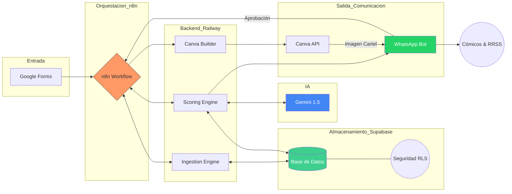

# AI LineUp Architect (MVP) 🎭

**Estado del Proyecto:** 🛠️ En Desarrollo (Fase de Cimentación)  
**Versión:** 0.1.0-alpha  
**Metodología:** Spec-Driven Development (SDD)

Sistema automatizado para la gestión y generación de lineups y cartelería para Open Mics de comedia.

El proyecto nace con una arquitectura **SaaS-Ready**, garantizando la privacidad de los datos entre diferentes productores mediante un modelo de datos maestro/detalle y políticas de seguridad avanzadas.

## 📝 Visión del Proyecto
El objetivo de este MVP es automatizar el ciclo de vida semanal de un Open Mic, reduciendo la carga administrativa del organizador y utilizando IA para optimizar la selección de cómicos y la creación de activos visuales.

## 🌳 Estrategia de Ramas (Git Flow)

Para mantener la estabilidad del proyecto, seguimos una estructura de ramificación sencilla pero rigurosa:

* **`main`**: Contiene exclusivamente código estable, probado y listo para producción (versiones cerradas).
* **`dev`**: Rama principal de desarrollo. Todas las nuevas funcionalidades, correcciones y experimentos se integran aquí antes de pasar a `main`.

> **Regla de oro:** Nunca se realizan commits directos en `main`. Todo cambio debe pasar primero por `dev` y ser validado.


## 🔄 Flujo de Trabajo (Lifecycle)
1. **Ingesta:** Procesamiento de solicitudes recibidas a través de Google Forms.
2. **Curación:** Selección asistida por IA del lineup semanal basada en el historial y criterios de puntuación.
3. **Generación:** Creación automática del cartel del evento en Canva mediante su API.
4. **Histórico:** Actualización automática de la base de datos tras la validación del host.



## 🛠️ Stack Tecnológico Inicial
- **Orquestación:** n8n
- **Backend:** Python (Lógica de scoring y procesamiento)
- **Base de Datos:** Supabase (PostgreSQL)
- **IA:** OpenAI API / Gemini (Validación y curación)
- **Diseño:** Canva API

## 🚀 Objetivos del MVP
- Centralizar las solicitudes en una capa de datos limpia ("Silver Layer").
- Automatizar el cálculo de puntos (tiempo desde la última actuación, paridad, prioridad).
- Generar el póster final sin intervención manual en el diseño.
- Mantener un registro histórico fiable de quién actúa en cada show.

## 🛠️ Herramientas de Infraestructura (Novedad)
Para mantener la integridad de la base de datos en Supabase, el proyecto incluye:
- **`setup_db.py`**: Script de automatización que gestiona:
    - **Backup Preventivo:** Exportación a CSV en `/backups` antes de cualquier cambio destructivo.
    - **Evolución de Esquema:** Ejecución secuencial de SQL (Tablas -> Enums -> Migraciones).
    - **Seeding:** Inyección de datos de prueba (incluyendo perfiles restringidos) para testing.

## 🏗️ Estructura del Proyecto (Refactorizada)
```text
/
├── backend/              # Lógica de negocio en Python
│   ├── src/              # Ingestion, Scoring y Canva Builder
│   └── setup_db.py       # Herramienta de despliegue y backups
├── backups/              # Volcados temporales de seguridad (Local CSV) [GIT IGNORED]
├── specs/                # Fuente de verdad (Source of Truth)
│   └── sql/              # Esquemas, Migraciones y Seed Data
├── workflows/            # Planos de automatización (n8n)
├── .env                  # Variables críticas (DB_URL, Drive_ID, etc.)
├── package.json          # Versión del proyecto (SemVer)
└── README.md             # Esta documentación
```

---
*Este proyecto se desarrolla con un enfoque progresivo, priorizando la automatización del flujo crítico antes de añadir capas de complejidad adicional.*
