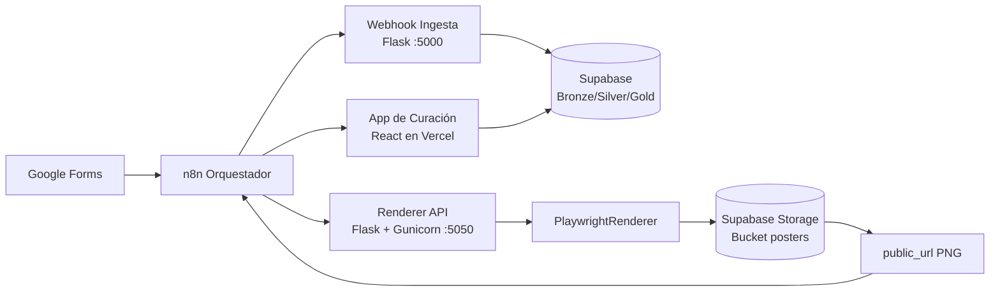

# AI LineUp Architect 🎭

**Estado del Proyecto:** 🛠️ En desarrollo activo
**Versión:** `0.5.61`
**Metodología:** Spec-Driven Development (SDD)

Sistema para ingesta, curación y generación automática de cartel de Open Mics, con trazabilidad completa desde formularios hasta artefacto final publicado.

## 1. Fuente de verdad técnica (v0.5.61)

En esta versión se consolidan los siguientes cambios estructurales:

- **Nuevo compositor vectorial SVG (SDD v2):** se añade `backend/src/core/svg_composer.py` con clase `SVGLineupComposer` y función `export_to_png(...)` para generar carteles sin dependencia de navegador headless.
- **Safe Zone de lineup implementada en motor SVG:** distribución dinámica de nombres dentro del rango vertical `Y=400..1100`, con reducción proporcional de `font-size` cuando `N > 5`.
- **Modelo híbrido SVG v2:** `backend/src/core/svg_composer.py` reemplaza capas vectoriales de fondo por `<image href="data:image/png;base64,...">` y mantiene solo capa dinámica de texto sobre diseño base.
- **Orden de capas blindado en SVG:** la capa `<image>` se pinta primero (justo tras abrir `<svg>`) y el bloque de datos (`names_svg` + fecha) se renderiza al final para garantizar texto por delante del fondo.
- **Validación estricta de assets del compositor:** antes de generar SVG se verifica con `os.path.exists()` la presencia de fuente `.ttf` y póster base `.png`; ante ausencia se lanza `ERR_ASSET_MISSING`.
- **Modo de depuración visual extrema (fase validación):** la capa de datos se emite en estilo inline por `<text>` con `fill="#00FF00"`, `stroke="#FF00FF"` y `stroke-width="6"` para confirmar render por encima del fondo.
- **Assets embebidos para CairoSVG robusto:** imagen base y fuente se serializan en Base64 (`data URI`) y se cachean tras la primera lectura para evitar dependencias de resolución `file://`.
- **Estructura XML de emergencia:** root `<svg>` incluye `xmlns:xlink`, la imagen usa `xlink:href`, y todos los textos se encapsulan en `<g id="overlay-text">`; además `generate_poster(...)` imprime `DEBUG` con el total de nombres renderizados.
- **Cobertura QA del compositor:** nueva suite `backend/tests/core/test_svg_composer.py` valida patrón/layers, límites Safe Zone y adaptabilidad tipográfica.

- **Plantilla activa ajustada para lineup completo (5 artistas):** `backend/src/templates/catalog/active/template.html` cambia `.lineup` a `height: auto` y reduce `.comico` a `font-size: 60px` para mejorar encaje vertical del cartel.
- **Micro embebido sin dependencia externa:** la silueta del micrófono deja de cargar una URL remota y usa un SVG embebido (`data:image/svg+xml`) para evitar fallos por recursos caídos/bloqueados.
- **Sincronización de captura más robusta en Playwright:** `backend/src/core/render.py` navega con `wait_until="networkidle"` sobre `file://...`, mantiene señal de `window.renderReady` y añade `await page.wait_for_timeout(2000)` previo al screenshot para asegurar el pintado final de fondo/micrófono.
- **Viewport fijado al canvas del diseño:** `capture_screenshot(...)` mantiene el viewport explícito `1080x1350` alineado al CSS del template.

- **Render Jinja2 previo a Playwright en MCP:** `backend/src/mcp_server.py` ahora procesa `template.html` con `jinja2.Environment` antes de capturar screenshot, inyectando `lineup`, `event_id` y fecha (`date`/`event.date`/`metadata.date_text`) directamente en el HTML final.
- **Sin dependencia de Data Binder en servidor MCP:** se elimina `generate_injection_js` del flujo `orchestrate_render -> execute_render`; Playwright recibe HTML ya expandido y solo sincroniza captura con `window.renderReady = true`.
- **Render temporal seguro:** el HTML renderizado se persiste en un archivo temporal `.html` en `/tmp` y se elimina tras `capture_screenshot(...)` para no dejar artefactos huérfanos.

- **Data Binder compatible con plantillas estáticas con Jinja sin renderizar:** `backend/src/core/data_binder.py` ahora limpia placeholders `{{ ... }}` / `` en nodos de texto y evita que aparezcan literales en la imagen final.
- **Mapeo dual de lineup en inyección DOM:** el binder mantiene soporte `.slot-n .name` y añade soporte para plantilla activa `.lineup .comico`, generando nodos dinámicos con los nombres recibidos desde n8n.
- **Sustitución de fecha en selectores de evento:** cuando detecta tokens de plantilla, inyecta fecha en `.footer`, `.event-date` o `[data-event-date]` antes de `window.renderReady`.
- **Cobertura ampliada del binder:** `backend/tests/core/test_data_binder.py` incorpora validación de reglas de reemplazo de placeholders y de mapeo por selectores de la plantilla activa.

- **Entrega de PNG por streaming en MCP HTTP:** `POST /tools/render_lineup` (FastAPI) devuelve ahora el archivo renderizado directamente como `image/png` mediante `FileResponse` (`filename="cartel.png"`), evitando dependencias de visibilidad de rutas `/tmp` entre contenedores.
- **Contrato de error explícito para motor de render:** cuando el render falla, el endpoint responde `HTTP 500` con JSON `{"error":"Render engine failed","details":"..."}` para diagnóstico en n8n.
- **Validación de artefacto antes de responder:** se comprueba `os.path.exists(output_path)` y se devuelve `HTTP 500` si el archivo no fue generado correctamente.
- **Cobertura HTTP ajustada al nuevo contrato binario:** `backend/tests/mcp/test_mcp_server_http.py` valida cabecera `image/png`, firma PNG y ruta de error 500 con payload de detalles.

- **Refactor visual de curación con UI v0 (sin migración de framework):** `frontend/src/App.jsx` mantiene la lógica de negocio actual (`fetchCandidates`, `updateDraft`, `toggleSelected`, `validateLineup`, Supabase RPC y webhook n8n) y extrae la capa de interfaz en componentes `jsx` dentro de `frontend/src/components/open-mic/` con estilo notebook/cartoon.
- **Notas de recuperación SDD en validación:** la validación del lineup añade `trace.recovery_notes` en el payload enviado a n8n, alimentado desde nuevo campo `textarea` de curación.
- **Estilos UI desacoplados de Next/shadcn:** `frontend/src/index.css` incorpora los estilos necesarios extraídos del ZIP (`paint-bg`, `notebook-lines`, `restricted-overlay`, `comic-shadow`) adaptados a React/Vite con Tailwind v3.

- **QA cleanup para CI Drone (Regla del Espejo):** las pruebas de módulos `backend/src/core/*` se consolidan exclusivamente en `backend/tests/core/*` para evitar `import file mismatch` por nombres de test duplicados.
- **Eliminación de duplicados de test:** se eliminan copias de `test_data_binder.py` y `test_security.py` en `backend/tests/mcp/`, manteniendo y ampliando cobertura en `backend/tests/core/`.
- **Unificación de tests de render core:** se elimina `backend/tests/unit/test_core_render.py` y su cobertura se integra en `backend/tests/core/test_render.py`.
- **Purga de integración legacy de Supabase:** se elimina `backend/tests/integration/test_supabase_storage.py` (la subida ya no se valida en backend test suite por cambio de responsabilidad a n8n).

- **Blindaje defensivo del Data Binder:** `backend/src/core/data_binder.py` valida payloads no-lista devolviendo un JS seguro (`window.renderReady = true;`), tolera entradas no dict en `_extract_name` y mantiene mapeo estable para lineups extensos (mapea hasta 8 slots sin romper con 0..20 artistas).
- **Validación HTTP robusta en endpoint MCP:** `POST /tools/render_lineup` ahora devuelve error controlado `422` para payloads inválidos (`event_id` ausente o `lineup` no lista) en lugar de permitir rutas de error 500.
- **Cobertura reforzada en tests core/mcp:** nuevas pruebas de `data_binder` para lineup vacío, lineup con strings y lineup de 10 personas; pruebas de `security` con `unittest.mock.patch('requests.get')` para cabecera EXE (`MZ`), PNG real, timeout y URL prohibida localhost.
- **Política de protocolo en seguridad de referencias:** `backend/src/core/security.py` permite únicamente `http/https` y conserva bloqueo explícito de hosts locales/privados (localhost, loopback y RFC1918).

- **Blindaje de infraestructura de tests (`pytest-asyncio`):** nuevo `pytest.ini` con `asyncio_mode = auto` y `asyncio_default_test_loop_scope = function` para compatibilidad con pytest v9 sin warnings de loop scope.
- **Refactor HTTP MCP sin puertos reales:** `backend/tests/mcp/test_mcp_server_http.py` usa `@pytest_asyncio.fixture` y `httpx.ASGITransport(app=app)` para probar FastAPI in-process, incluyendo cobertura para payload inválido (`test_render_invalid_payload`).
- **Cobertura core `data_binder` y `security`:** nuevas suites en `backend/tests/core/test_data_binder.py` y `backend/tests/core/test_security.py` para validar FitText, ocultación de slots no usados, hardening de URLs locales/privadas y validación de Magic Bytes contra archivos falsos.
- **Hardening SSRF en seguridad de render:** `backend/src/core/security.py` bloquea explícitamente hosts locales/privados (`localhost`, loopback, rangos RFC1918/link-local/reservados) antes de abrir requests externas.
- **Nueva suite QA del refactor render/MCP:** se agregan pruebas asíncronas en `backend/tests/core/test_render.py` (éxito, timeout y flags `--no-sandbox`) y en `backend/tests/mcp/test_mcp_server_http.py` (healthcheck HTTP, contrato `POST /tools/render_lineup` y verificación de lock de concurrencia vía peticiones simultáneas con `httpx`).
- **Higiene de artefactos temporales:** los nuevos tests eliminan PNG generados en `/tmp` al finalizar cada ejecución para mantener limpio el VPS.
- **Motor Playwright desacoplado:** nuevo módulo `backend/src/core/render.py` centraliza `capture_screenshot(...)` como única integración con Playwright (flags root `--no-sandbox` + `--disable-dev-shm-usage`, espera `window.renderReady === true` y cierre garantizado en `finally`).
- **MCP Renderer en modo HTTP para n8n:** `backend/src/mcp_server.py` ahora expone servidor HTTP en `127.0.0.1:5050` (`uvicorn`), endpoint REST `POST /tools/render_lineup`, healthcheck `GET /healthz` y montaje opcional de `FastMCP streamable HTTP` en `/mcp` cuando la librería `mcp[http]` está disponible.
- **Trazabilidad de tráfico de n8n:** middleware HTTP registra cada request y `event_id` en `backend/logs/mcp_render.log`.
- **Hardening de cierre Playwright:** el flujo de render usa cierre garantizado de `BrowserContext` y `Browser` en bloque `finally` para evitar procesos zombie de Chromium.
- **Operación PM2 del MCP HTTP:** nuevo `ecosystem.config.js` con comando `./.venv/bin/python -m backend.src.mcp_server` para ejecución persistente en VPS.

- **Servidor MCP de render (implementado):** `backend/src/mcp_server.py` expone `render_lineup` con lock global de concurrencia, gate de seguridad para `reference_image_url`, fallback automático a plantilla `active`, render Playwright con `--no-sandbox` + `--disable-dev-shm-usage`, espera `window.renderReady` y salida PNG en `/tmp/render_{event_id}.png` con trazabilidad de recuperación.
- **Suite de integración MCP Server (TDD asíncrono):** nueva batería en `backend/tests/mcp/test_server_integration.py` para contrato de orquestación end-to-end (éxito, recuperación por fallo de seguridad, lock de concurrencia y caja negra de metadatos sensibles) usando `pytest-asyncio` y `unittest.mock` para evitar navegador real.
- **Implementación del Data Binder (SDD §13):** `backend/src/core/data_binder.py` incorpora `generate_injection_script(lineup, max_slots)` (alias `generate_injection_js`) con inyección exclusiva de `name` por selector `.slot-n .name`, ocultación de slots vacíos con `style.display = 'none'`, FitText en pasos de `1px` hasta `12px` mínimo y señal final `window.renderReady = true` para sincronización Playwright.
- **TDD de capa de seguridad MCP:** la cobertura activa queda consolidada en `backend/tests/core/test_security.py` para validar HTTPS-only, bloqueo de wrappers (Google Drive/Dropbox), inspección de Magic Bytes (PNG/JPEG/WebP) y manejo de timeout de red con recuperación no bloqueante (`USE_ACTIVE_TEMPLATE`).
- **Nueva capa MCP Agnostic Renderer (spec-first):** se define el contrato agnóstico de entrada/salida, trazabilidad y modos `template_catalog`/`vision_generated` en `specs/mcp_agnostic_renderer_spec.md` como Fuente de Verdad previa a implementación.
- **Security Gate para imágenes de referencia:** `reference_image_url` exige pre-fetch de 32 bytes + inspección de Magic Bytes (PNG/JPEG/WebP), rechazo `ERR_INVALID_FILE_TYPE` y política de origen `Direct Link Only`/Supabase con bloqueo de wrappers HTML (`ERR_ACCESS_DENIED_OR_NOT_DIRECT_LINK`).
- **Jerarquía de resiliencia MCP (2 niveles):** se formaliza `Active Mode` por intent y fallback local obligatorio a `backend/src/templates/catalog/fallback/`, con warning de trazabilidad `SYSTEM_FALLBACK_TRIGGERED` en `trace.warnings`.
- **Persistencia condicional eficiente (`design-archive`):** solo `vision_generated` archiva `final.png`, `generated.html`, `generated.css`, `reference.png` y `metadata.json`; `template_catalog` no duplica almacenamiento en archivo.
- **Estándar de Unidad Atómica de Diseño (Sección 12):** cada `template_id` se define como carpeta autocontenida en `backend/src/templates/catalog/` con `template.html`, `style.css`, `manifest.json` y `assets/`, declarando que `manifest.json` es la única fuente de configuración de render.
- **Contrato técnico del `manifest.json`:** campos obligatorios `template_id`, `version`, `display_name`, `canvas.width/height`, `capabilities.min_slots/max_slots` y `font_strategy` (Google Fonts por `@import`).
- **Pre-vuelo de capacidad con override auditado:** validación `len(lineup)` vs `manifest.capabilities.max_slots`, error `TEMPLATE_CAPACITY_EXCEEDED`, soporte de `intent.force_capacity_override` y log obligatorio `CAPACITY_OVERRIDE_ACTIVE` con advertencia de riesgo estético bajo responsabilidad del Host.
- **Sección 13 del SDD (inyección visual + FitText + output mínimo):** se formaliza el binding estricto `lineup[n].name -> .slot-(n+1) .name`, la exclusión visual de `lineup[n].instagram`, el auto-ajuste tipográfico por overflow (`scrollWidth` vs `clientWidth`, paso 2px hasta `min-font-size` del `manifest.json`) y la responsabilidad única de salida (`public_url` + `trace`).
- **Sección 14 del SDD (Fallo No Bloqueante):** se formaliza política `HTTP 200 OK` para render exitoso (incluyendo recuperación), matriz obligatoria de auto-recuperación (`ERR_CONTRACT_INVALID`, `ERR_INVALID_FILE_TYPE`, `ERR_NOT_DIRECT_LINK`, `ERR_CAPACITY_EXCEEDED`), trazabilidad `trace.status = recovered_with_warnings` + `trace.recovery_notes` y abortos reales acotados a `ERR_RENDER_ENGINE_CRASH` / `ERR_STORAGE_UNREACHABLE`.
- **Hardening de workflows n8n:** `workflows/n8n/LineUp.json` elimina credenciales/hosts hardcodeados y usa variables de entorno (`$env`) para Supabase y renderer.
- **Nueva variable de entorno para render en n8n:** `N8N_BACKEND_RENDER_URL` documentada en `.env.example`.
- **Deprecación de Canva:** la integración con Canva API queda retirada del flujo productivo.
- **Motor de diseño propio:** el render final se realiza con `PlaywrightRenderer`.
- **Desacople por puertos (SDD):**
  - **Webhook Ingesta (Flask):** `:5000`
  - **Renderer API (Flask + Gunicorn):** `:5050`
- **Infraestructura objetivo:** ejecución directa en **VPS Ubuntu** con **PM2** para persistencia de procesos.
- **Salida de render:** PNG subido al bucket `posters` de Supabase Storage, devolviendo `public_url`.

## 2. Arquitectura de sistema



## 3. Stack tecnológico e infraestructura

| Capa | Tecnología | Rol en el sistema |
|---|---|---|
| Hosting | VPS Ubuntu | Entorno principal de ejecución en producción. |
| Orquestación | n8n | Coordinación de flujos (ingesta, validación y render). |
| Ingesta API | Flask (`backend/src/triggers/webhook_listener.py`) | Endpoint webhook para normalización y paso Bronze → Silver en `:5000`. |
| Render API | Flask + Gunicorn (`backend/src/app.py`) | Endpoint `POST /render-lineup` en `:5050`. |
| Motor de Cartelería | Playwright + Jinja2 (`PlaywrightRenderer`) | Generación del PNG final en runtime local. |
| Persistencia de procesos | PM2 | Gestión de procesos `webhook-ingesta` y `recova-renderer`. |
| Base de datos | Supabase PostgreSQL | Capas `bronze`, `silver`, `gold` para trazabilidad y scoring. |
| Almacenamiento de artefactos | Supabase Storage (`posters`) | Hosting del cartel final y emisión de `public_url`. |
| Curación operativa | React en Vercel | Validación manual del lineup antes de render final. |

## 4. APIs de producción

### 4.1 Webhook de ingesta (`:5000`)

- Endpoint principal de disparo:
  - `POST /ingest`
- Uso típico:
  - n8n recibe trigger y envía payload al webhook.
  - El servicio procesa reglas de normalización y persiste en Supabase.

Ejemplo local:

```bash
curl -X POST http://localhost:5000/ingest \
  -H "Content-Type: application/json" \
  -d '{"trigger":"n8n"}'
```

### 4.2 Renderer API (`:5050`)

- Endpoint productivo:
  - `POST /render-lineup`
- Contrato:
  - Valida payload según spec SDD de renderer.
  - Renderiza PNG con `PlaywrightRenderer`.
  - Sube archivo a Supabase Storage (`posters`).
  - Responde con `public_url` y metadatos del render.

#### Ejecución recomendada con Gunicorn (producción)

```bash
./.venv/bin/gunicorn -w 4 -b 0.0.0.0:5050 backend.src.app:app
```

#### Gestión con PM2

```bash
pm2 start "./.venv/bin/gunicorn -w 4 -b 0.0.0.0:5050 backend.src.app:app" --name recova-renderer
pm2 start "./.venv/bin/python backend/src/triggers/webhook_listener.py" --name webhook-ingesta
```

## 5. Almacenamiento de carteles (Supabase Storage)

Flujo de salida de cartelería:

1. Renderer genera PNG temporal local.
2. El archivo se sube al bucket `posters`.
3. Se publica URL accesible (`public_url`).
4. Se elimina el temporal local tras upload exitoso.

Ruta lógica esperada del archivo:

- `YYYY-MM-DD/lineup_{request_id}.png`

## 6. Modelo de datos y pipeline

- **Bronze:** ingesta cruda de formularios.
- **Silver:** datos normalizados y consistentes para operación.
- **Gold:** capa de scoring/histórico para selección de lineup.

Resumen del pipeline:

1. n8n recibe trigger externo.
2. n8n invoca Webhook Ingesta (`:5000`).
3. La curación operativa se realiza desde la app React en Vercel.
4. n8n solicita render final a Renderer API (`:5050`).
5. El PNG queda en `posters` y se devuelve `public_url`.

## 7. Operación y desarrollo

### 7.1 Preparación

```bash
python3 -m venv .venv
source .venv/bin/activate
pip install -r requirements.txt
playwright install chromium
playwright install-deps
```

> Nota VPS/producción: instalar Chromium y dependencias del sistema evita el fallback local de render y mejora la trazabilidad de errores reales de arranque del navegador.

### 7.2 Base de datos (setup)

```bash
./.venv/bin/python setup_db.py
./.venv/bin/python setup_db.py --seed
./.venv/bin/python setup_db.py --reset --seed
```

### 7.3 Tests

```bash
./.venv/bin/python -m pytest -q
./.venv/bin/python -m pytest -q backend/tests/unit
./.venv/bin/python -m pytest -q backend/tests/integration
```

## 8. Estructura del repositorio (alto nivel)

```text
.
├── AGENTS.md
├── README.md
├── CHANGELOG.md
├── .env.example
├── requirements.txt
├── pyproject.toml
├── package.json
├── setup_db.py
├── backups/
│   └── .gitkeep
├── backend/
│   ├── assets/
│   │   ├── fonts/
│   │   │   └── BebasNeue.ttf
│   │   └── templates/
│   │       └── base_poster.png
│   ├── database/
│   │   └── setup_frontend_logic.sql
│   ├── src/
│   │   ├── app.py
│   │   ├── bronze_to_silver_ingestion.py
│   │   ├── mcp_server.py
│   │   ├── scoring_engine.py
│   │   ├── core/
│   │   │   ├── data_binder.py
│   │   │   ├── render.py
│   │   │   ├── security.py
│   │   │   └── svg_composer.py
│   │   ├── old/
│   │   │   ├── app.py
│   │   │   ├── ingestion_cli_backup.py
│   │   │   ├── lineup_v1.html
│   │   │   ├── lineup_v2.html
│   │   │   ├── playwright_renderer.py
│   │   │   └── test/
│   │   │       ├── test_app.py
│   │   │       ├── test_canva_builder.py
│   │   │       ├── test_playwright_renderer.py
│   │   │       └── test_supabase_upload.py
│   │   ├── triggers/
│   │   │   └── webhook_listener.py
│   │   └── templates/
│   │       └── catalog/
│   │           └── active/
│   │               └── template.html
│   ├── tests/
│   │   ├── .gitkeep
│   │   ├── conftest.py
│   │   ├── core/
│   │   │   ├── test_data_binder.py
│   │   │   ├── test_render.py
│   │   │   ├── test_security.py
│   │   │   └── test_svg_composer.py
│   │   ├── mcp/
│   │   │   ├── test_mcp_server_http.py
│   │   │   └── test_server_integration.py
│   │   ├── unit/
│   │   │   ├── test_bronze_to_silver_ingestion.py
│   │   │   ├── test_n8n_workflows_security.py
│   │   │   ├── test_scoring_engine.py
│   │   │   ├── test_setup_db.py
│   │   │   └── test_webhook_listener.py
│   │   └── sql/
│   │       └── test_sql_contracts.py
│   └── logs/
│       ├── canva_auth.log
│       ├── canva_auth.log.2026-02-18
│       ├── canva_auth.log.2026-02-19
│       ├── canva_builder.log
│       └── mcp_render.log
├── docs/
│   ├── bronze-multi-proveedor-master-data.md
│   ├── bronze-silver-comicos-sync.md
│   ├── bronze-solo-solicitudes-linaje-silver.md
│   ├── canva-oauth-pkce-builder.md
│   ├── curacion-lineup-validacion-estados-gold-silver.md
│   ├── esquemas-bronze-silver.md
│   ├── github-actions-deploy-dev.md
│   ├── ingesta-atomica-n8n.md
│   ├── ingesta-batch-bronze-queue.md
│   ├── ingesta-bronze-silver-error-handling.md
│   ├── ingesta-bronze-silver-reserva.md
│   ├── ingesta-constraint-unicidad-proveedor-slug.md
│   ├── ingesta-logs-auditoria.md
│   ├── ingesta-whatsapp-show-cercano-origen.md
│   ├── mcp-agnostic-renderer-spec.md
│   ├── n8n-workflows-secretos-entorno.md
│   ├── proveedor-default-recova.md
│   ├── refactor-validacion-bronze-silver.md
│   ├── render-api-produccion.md
│   ├── scoring-batch-n8n-fix.md
│   ├── seed-data-casos-borde.md
│   ├── seed-unique-comico-fecha-fix.md
│   ├── sdd_v2_svg_renderer.md
│   ├── setup-db-backup-local.md
│   ├── setup-db-backup-reset-seed.md
│   ├── setup-db-migraciones.md
│   ├── silver-relacional.md
│   ├── stack-tecnologico-infraestructura-mvp.md
│   ├── tests-backend.md
│   └── webhook-listener-n8n-ingesta.md
├── frontend/
│   ├── index.html
│   ├── package.json
│   ├── postcss.config.js
│   ├── tailwind.config.js
│   ├── vite.config.js
│   └── src/
│       ├── App.jsx
│       ├── components/
│       │   └── open-mic/
│       │       ├── ComicCard.jsx
│       │       ├── ExpandedView.jsx
│       │       ├── Header.jsx
│       │       ├── NotebookSheet.jsx
│       │       └── ValidateButton.jsx
│       ├── index.css
│       ├── main.jsx
│       └── supabaseClient.js
├── specs/
│   ├── frontend_lineup_notebook_spec.md
│   ├── mcp_agnostic_renderer_spec.md
│   ├── playwright_renderer_spec.md
│   ├── workflows/
│   │   └── n8n_workflow_secret_externalization.md
│   └── sql/
│       ├── bronze_multi_proveedor_master.sql
│       ├── gold_relacional.sql
│       ├── seed_data.sql
│       ├── silver_relacional.sql
│       └── migrations/
│           ├── 20260212_alter_tipo_solicitud_status.sql
│           ├── 20260217_drop_score_final_from_silver_solicitudes.sql
│           ├── 20260217_fix_anon_update_policy_silver_comicos.sql
│           ├── 20260217_sync_lineup_validation_states.sql
│           └── 20260218_create_lineup_candidates_and_validate_lineup.sql
├── workflows/
│   ├── main_pipeline.json
│   └── n8n/
│       ├── Ingesta-Solicitudes.json
│       ├── LineUp.json
│       └── Scoring & Draft.json
```

## 9. Referencias internas recomendadas

- `specs/playwright_renderer_spec.md`
- `specs/mcp_agnostic_renderer_spec.md`
- `specs/frontend_lineup_notebook_spec.md`
- `docs/mcp-agnostic-renderer-spec.md`
- `docs/sdd_v2_svg_renderer.md`
- `docs/curacion-lineup-validacion-estados-gold-silver.md`
- `docs/render-api-produccion.md`
- `docs/webhook-listener-n8n-ingesta.md`
- `docs/tests-backend.md`

---

Este README define el estado operativo objetivo de la versión `0.5.61` y debe tratarse como referencia principal para decisiones de implementación y despliegue.
