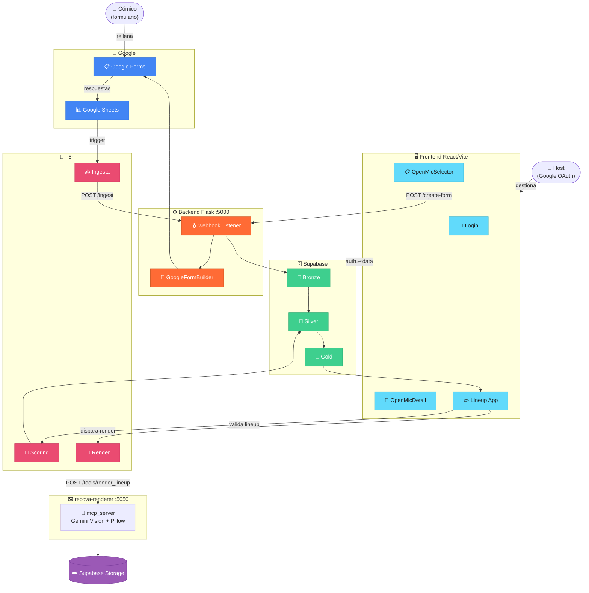

# AI LineUp Architect

**Versión:** `0.17.9` · **Estado:** Desarrollo activo · **Metodología:** SDD + TDD

SaaS multi-tenant para gestión de open mics de comedia. Automatiza la recogida de solicitudes (Google Forms), el scoring con IA y la generación del cartel en PNG.

---

## Arquitectura



---

## Stack

| Capa | Tecnología |
|------|-----------|
| Frontend | React + Vite + Tailwind |
| Backend | Python / Flask :5000 |
| Renderer | mcp_server.py — FastAPI :5050 (Gemini Vision + Pillow) |
| Base de datos | Supabase (PostgreSQL — Bronze / Silver / Gold) |
| Auth | Supabase (Google OAuth) |
| Orquestación | n8n |
| Formularios | Google Forms + Sheets API (OAuth2) |
| Procesos | PM2 en VPS Ubuntu (Hetzner) · Traefik — `api.machango.org` |
| Bot Telegram | `@ailineup_bot` (n8n + Gemini 2.5 Flash) |

---

## Estructura

```
recova-project/
├── backend/
│   ├── assets/               # Fuentes y posters base (Pillow)
│   ├── scripts/              # OAuth2, seed, reset
│   ├── src/
│   │   ├── core/             # Módulos: scoring, render, forms, security
│   │   ├── triggers/         # webhook_listener.py (Flask :5000)
│   │   ├── bronze_to_silver_ingestion.py
│   │   ├── scoring_engine.py
│   │   └── mcp_server.py     # Renderer API (FastAPI :5050)
│   └── tests/
│       ├── core/             # Tests módulos core
│       ├── mcp/              # Tests renderer
│       ├── scripts/          # Tests scripts utilidad
│       └── unit/             # Tests unitarios generales
├── frontend/
│   └── src/
│       ├── components/       # OpenMicSelector, OpenMicDetail, ScoringConfigurator…
│       ├── App.jsx           # Lineup app (curación)
│       └── main.jsx          # Root: Login → Selector → Detail → App
├── specs/                    # Specs SDD + esquemas y migraciones SQL
├── docs/                     # Documentación técnica
├── workflows/n8n/            # Workflows exportados
└── CHANGELOG.md
```

---

## Inicio rápido

```bash
# Backend
pip install -r requirements.txt
PYTHONPATH=. python backend/src/triggers/webhook_listener.py   # Flask :5000
PYTHONPATH=. python -m backend.src.mcp_server                  # Renderer :5050

# Frontend
cd frontend && npm install && npm run dev
```

Variables de entorno: [`docs/setup.md`](docs/setup.md)

---

## Tests

```bash
source backend/venv/bin/activate
PYTHONPATH=. pytest backend/tests/        # 312 tests backend
cd frontend && npm test                   # 20 tests frontend
```

---

## Documentación

| Documento | Descripción |
|-----------|-------------|
| [`docs/architecture.md`](docs/architecture.md) | Variables de entorno y capas |
| [`docs/setup.md`](docs/setup.md) | Setup local y producción |
| [`docs/sprints.md`](docs/sprints.md) | Historial de sprints y roadmap |
| [`CHANGELOG.md`](CHANGELOG.md) | Historial de versiones |
