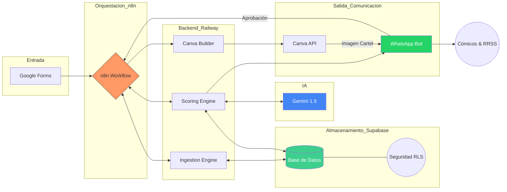

# AI LineUp Architect (MVP) 🎭

**Estado del Proyecto:** 🛠️ En Desarrollo (MVP)  
**Versión:** 0.5.14  
**Metodología:** Spec-Driven Development (SDD)

Sistema automatizado para la gestión y generación de lineups y cartelería para Open Mics de comedia.

## Novedades recientes (0.5.14)
- La migración `specs/sql/migrations/20260217_sync_lineup_validation_states.sql` ahora elimina explícitamente la vista `gold.lineup_candidates` antes de recrearla.
- Este ajuste evita errores en `setup_db.py --reset --seed` y despliegues donde coexistían definiciones antiguas de la vista con columnas incompatibles.

El proyecto nace con una arquitectura **SaaS-Ready**, garantizando la privacidad de los datos entre diferentes productores mediante un modelo de datos maestro/detalle y políticas de seguridad avanzadas.

## 📝 Visión del Proyecto
El objetivo de este MVP es automatizar el ciclo de vida semanal de un Open Mic, reduciendo la carga administrativa del organizador y utilizando IA para optimizar la selección de cómicos y la creación de activos visuales.

## 🌳 Estrategia de Ramas (Git Flow)

Para mantener la estabilidad del proyecto, seguimos una estructura de ramificación sencilla pero rigurosa:

* **`main`**: Contiene exclusivamente código estable, probado y listo para producción (versiones cerradas).
* **`dev`**: Rama principal de desarrollo. Todas las nuevas funcionalidades, correcciones y experimentos se integran aquí antes de pasar a `main`.

> **Regla de oro:** Nunca se realizan commits directos en `main`. Todo cambio debe pasar primero por `dev` y ser validado.


## 🔄 Flujo de Trabajo (Lifecycle)
1. **Ingesta:** Procesamiento de solicitudes recibidas a través de Google Forms.
2. **Curación:** Selección asistida por IA del lineup semanal basada en el historial y criterios de puntuación.
3. **Generación:** Creación automática del cartel del evento en Canva mediante su API.
4. **Histórico:** Actualización automática de la base de datos tras la validación del host.



## 🧱 Stack Tecnológico e Infraestructura (MVP Actual)

### 🖥️ Servidor y Despliegue (Self-Hosted)

| Componente | Implementación | Rol en el sistema |
|---|---|---|
| 🌐 VPS | Servidor propio vinculado al dominio **machango.org** | Punto central de ejecución y exposición de servicios del MVP. |
| 🧊 Coolify | Gestor de aplicaciones y contenedores | Estandariza despliegues, reinicios, variables de entorno y operación continua. |
| 🔄 n8n | Instalado en el VPS (nativo/contenedor) | Orquestación event-driven de flujos, webhooks y automatizaciones en tiempo real. |

### 🗄️ Base de Datos (Cloud)

| Capa | Tecnología | Propósito |
|---|---|---|
| 🥉 Bronze | Supabase PostgreSQL (`bronze.solicitudes`) | Almacenamiento RAW e inmutable de ingesta (trazabilidad total). |
| 🥈 Silver | Supabase PostgreSQL (`silver.*`) | Datos normalizados y relacionales para operación, scoring y reporting. |
| 🥇 Gold | Supabase PostgreSQL (`gold.*`) | Perfiles enriquecidos e histórico de solicitudes con score aplicado para decisiones de lineup. |

> Supabase se mantiene como motor principal PostgreSQL en la nube, mientras la lógica operativa del MVP vive en infraestructura self-hosted.

### 🔌 Herramientas Externas e Integraciones

- ☁️ **Google Cloud Platform (OAuth2):** autenticación y permisos para integración con **Google Sheets** y **Google Drive**.
- 🐍 **Python 3.10+:** ejecución de los motores de **ingesta, limpieza y scoring** de negocio.
- 🧠 **OpenAI API (Preparado):** capa lista para curación y validación de lenguaje natural en comentarios/contexto.
- 🎨 **Canva API:** generación automatizada del cartel final cuando el estado del lineup queda aprobado.

### 🔁 Flujo de Datos (Resumen Operativo)

1. 📥 Una nueva fila o evento en **Google Sheets** dispara un trigger en **n8n**.
2. ⚙️ **n8n**, ejecutándose en el VPS bajo la operación de **Coolify**, activa el script local de **Python**.
3. 🥉 El script persiste la entrada RAW en **Bronze** y aplica normalización/reglas de negocio.
4. 🥈 Los datos curados se escriben en **Silver** para trazabilidad transaccional y preparación de scoring.
5. 🥇 El scoring engine consume Silver, calcula prioridad y persiste resultados en **Gold**.
6. 📤 El flujo continúa con notificaciones/acciones posteriores (aprobación host, generación de cartel y distribución).

## 🚀 Objetivos del MVP
- Mantener ingesta cruda en `bronze.solicitudes` y curación transaccional en `silver`.
- Automatizar el cálculo de puntos (categoría, recencia y disponibilidad) desde Silver hacia Gold.
- Generar el póster final sin intervención manual en el diseño.
- Mantener un registro histórico fiable de quién actúa en cada show.

## 🛠️ Herramientas de Infraestructura (Novedad)
Para mantener la integridad de la base de datos en Supabase, el proyecto incluye:
- **`setup_db.py`**: Script de automatización que gestiona:
    - **Backup Preventivo:** Exportación a CSV en `/backups` antes de cualquier cambio destructivo.
    - **Evolución de Esquema:** Ejecución secuencial de SQL por capas (`bronze` -> `silver` -> migraciones -> `gold`).
    - **Seeding:** Inyección de datos de prueba alineados al linaje `bronze -> silver`.
- **`specs/sql/gold_relacional.sql`**: Define la capa Gold (perfiles + historial de scoring), incluyendo RLS/policies para `service_role`.

## 🗃️ Modelo de Datos (Bronze/Silver/Gold)
- **`bronze.solicitudes`**:
  - Única tabla en Bronze.
  - Conserva campos crudos del formulario (`*_raw`) y `raw_data_extra` (`jsonb`).
- **`silver.comicos`**:
  - Maestro de identidad única por `instagram` normalizado (minúsculas y sin `@`).
  - Incluye `genero` (`text`) con valor por defecto `unknown`.
- **`silver.proveedores`**:
  - Maestro de Open Mics / organizadores.
- **`silver.solicitudes`**:
  - Tabla transaccional con FKs a `silver.comicos` y `silver.proveedores`.
  - Trazabilidad obligatoria mediante `bronze_id` (`FK -> bronze.solicitudes(id)`).
- **`gold.comicos`**:
  - Maestro enriquecido para scoring (género, categoría, fecha de última actuación).
  - Conserva identificadores normalizados (`telefono`, `instagram`) y linaje por `id`.
- **`gold.solicitudes`**:
  - Histórico operativo de solicitudes con `estado`, `score_aplicado` y `marca_temporal`.
  - FK a `gold.comicos(id)` para reglas de recencia y selección.
- **`gold.vw_linaje_silver_a_gold`**:
  - Vista de cruce Silver -> Gold por telefono/instagram para resolver linaje.
- **Tipos y seguridad**:
  - Enums en `silver`: `silver.tipo_categoria`, `silver.tipo_status`.
  - Enums en `gold`: `gold.categoria_comico`, `gold.estado_solicitud`.
  - RLS habilitado en Bronze, Silver y Gold para `service_role`.

## ⚙️ Operación Local (DB)
1. Configura `DATABASE_URL` en `.env`.
2. Ejecuta por consola (recomendado con entorno virtual del proyecto):
   - `./.venv/bin/python setup_db.py`
3. Opciones disponibles:
   - Solo esquema: `./.venv/bin/python setup_db.py`
   - Esquema + seed: `./.venv/bin/python setup_db.py --seed`
   - Reset + esquema: `./.venv/bin/python setup_db.py --reset`
   - Reset + esquema + seed: `./.venv/bin/python setup_db.py --reset --seed`
4. Alternativa si no usas `.venv`:
   - `python3 setup_db.py [--reset] [--seed]`

Comportamiento actual de flags:
- `--reset`: genera backup CSV de tablas objetivo en `backups/`, elimina esquemas `gold`/`silver`/`bronze` y reaplica SQL.
- `--seed`: ejecuta `specs/sql/seed_data.sql` después de aplicar el esquema.
- `--reset --seed`: combinación completa (backup + reset + esquema + seed).

## 🧪 Ejecución de Tests
Los tests del backend viven en `backend/tests` y se ejecutan con `pytest`.

1. Suite completa:
   - `./.venv/bin/python -m pytest -q`
2. Con detalle:
   - `./.venv/bin/python -m pytest -v`
3. Solo unit tests:
   - `./.venv/bin/python -m pytest -q backend/tests/unit`
4. Solo contratos SQL:
   - `./.venv/bin/python -m pytest -q backend/tests/sql`
5. Archivo específico:
   - `./.venv/bin/python -m pytest -q backend/tests/unit/test_scoring_engine.py`
6. Caso puntual:
   - `./.venv/bin/python -m pytest -q backend/tests/sql/test_sql_contracts.py::test_gold_supports_lineage_bridge_with_silver`

Referencia extendida: `docs/tests-backend.md`

## 💻 Frontend (Vite + React + Tailwind)
La interfaz web vive en `frontend/` y usa `@supabase/supabase-js` con `db.schema = 'gold'` por defecto.

Configuración:
1. En `frontend/`, copia `.env.example` a `.env`.
2. Define:
   - `VITE_SUPABASE_URL`
   - `VITE_SUPABASE_ANON_KEY`
   - `VITE_N8N_WEBHOOK_URL` (URL absoluta `http/https` del webhook de n8n)

Desarrollo local:
- `cd frontend`
- `npm install`
- `npm run dev`

Build:
- `cd frontend`
- `npm run build`

## 🔁 Flujo de Ingesta Bronze -> Silver
El ingestion engine (`backend/src/bronze_to_silver_ingestion.py`) prepara el linaje operativo:
1. Lee registros pendientes en `bronze.solicitudes`.
2. Normaliza `instagram_raw`.
3. Hace upsert en `silver.comicos`.
4. Inserta en `silver.solicitudes` con `bronze_id`, `comico_id` y `proveedor_id`.

## 🧮 Motor de Scoring (Silver -> Gold)
El scoring engine (`backend/src/scoring_engine.py`) transforma solicitudes curadas en ranking operativo.

- Entrada: solicitudes ordenadas por `marca_temporal` (cola Silver).
- Reglas base:
  - Bono por categoría (`gold`: +12, `preferred`: +10, `standard`: +0).
  - Penalización por recencia de aceptación en los dos últimos shows (`-100`).
  - Bono por "bala única" cuando el cómico solo reporta una fecha (`+20`).
- Salida:
  - Inserción de registros `pendiente` con `score_aplicado` en historial Gold.
  - Resumen JSON con `filas_procesadas`, `filas_insertadas_gold`, `filas_descartadas_blacklist` y `top_10_sugeridos`.
  - `build_ranking` aplica intercalado por género con prioridad F/NB -> M -> Unknown y deduplicación por `comico_id` para evitar candidatos repetidos.
- Logging: archivo rotativo diario en `/root/RECOVA/backend/logs/scoring_engine.log` (retención 14 días).

Ejecución local:
- `./.venv/bin/python backend/src/scoring_engine.py`
- dummy test integrado: `SCORING_ENGINE_DUMMY_TEST=true ./.venv/bin/python backend/src/scoring_engine.py`

## 🌐 Webhook Listener (n8n -> Ingesta)
Se añadió un listener HTTP en Flask para que n8n dispare la ingesta Bronze -> Silver.

- Archivo: `backend/src/triggers/webhook_listener.py`
- Endpoint: `POST /ingest`
- Seguridad: header `X-API-KEY` validado contra `WEBHOOK_API_KEY`
- Acción: ejecuta `backend/src/bronze_to_silver_ingestion.py` vía `subprocess.run`

Ejecución local:
- `./.venv/bin/python backend/src/triggers/webhook_listener.py`
- alternativa: `python3 backend/src/triggers/webhook_listener.py`

Ejemplo de llamada:
```bash
curl -X POST http://localhost:5000/ingest \
  -H "X-API-KEY: TU_WEBHOOK_API_KEY"
```

Referencia extendida: `docs/webhook-listener-n8n-ingesta.md`

## 🚚 Deploy Automatizado (Rama `dev`)
El workflow `.github/workflows/deploy.yml` despliega al VPS por SSH en cada push a `dev`:
1. `git pull origin dev`
2. `pip install -r requirements.txt`
3. ejecución de la suite `backend/tests` en servidor (gate previo)
4. reinicio/start de PM2 para `webhook-ingesta` solo si el test es exitoso

## 🏗️ Estructura del Proyecto (Refactorizada)
```text
/
├── backend/              # Lógica de negocio en Python
│   ├── src/              # Ingestion, Scoring, Canva Builder y triggers
│   │   ├── scoring_engine.py
│   │   └── triggers/     # Webhook listener para disparar ingesta
│   └── tests/            # Suite pytest (unit + contratos SQL)
│       ├── unit/test_scoring_engine.py
│       └── sql/test_sql_contracts.py
├── frontend/             # App web (Vite + React + Tailwind)
│   └── src/
├── .github/workflows/    # CI/CD
│   └── deploy.yml
├── backups/              # Volcados temporales de seguridad (Local CSV) [GIT IGNORED]
├── specs/                # Fuente de verdad (Source of Truth)
│   └── sql/              # Esquemas, Migraciones y Seed Data
│       └── gold_relacional.sql
├── workflows/            # Planos de automatización (n8n)
├── .env                  # Variables críticas (DB_URL, Drive_ID, etc.)
├── setup_db.py           # Herramienta de despliegue, reset y backups de BD
├── package.json          # Versión del proyecto (SemVer)
└── README.md             # Esta documentación
```

---
*Este proyecto se desarrolla con un enfoque progresivo, priorizando la automatización del flujo crítico antes de añadir capas de complejidad adicional.*
