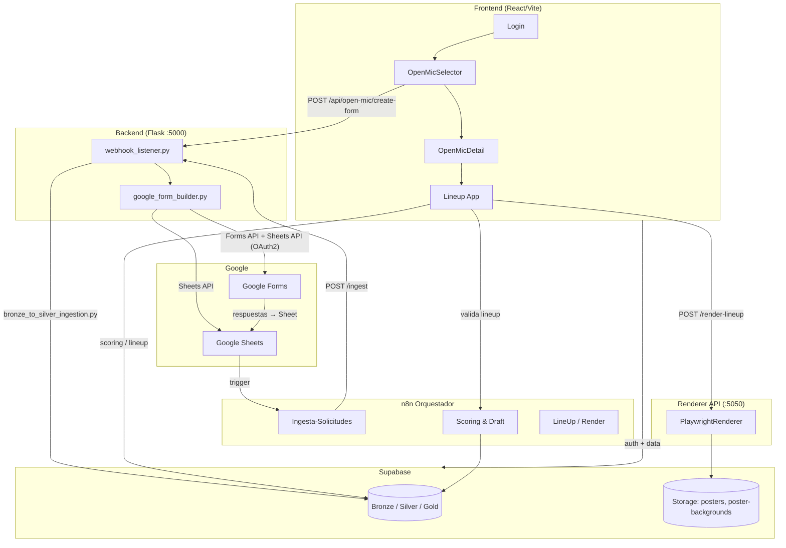

# Arquitectura del sistema

**Versión:** 0.7.0

## Diagrama



## Capas de datos (Medallion)

| Capa | Tabla principal | Rol |
|------|----------------|-----|
| Bronze | `bronze.solicitudes` | Ingesta cruda de formularios |
| Silver | `silver.open_mics`, `silver.comicos`, `silver.solicitudes` | Datos normalizados y operativos |
| Gold | `gold.lineup_candidates` (view) | Candidatos con scoring para curación |

## Servicios en producción (VPS)

| Servicio | Puerto | Proceso PM2 |
|----------|--------|-------------|
| Webhook ingesta | `:5000` | `webhook-ingesta` |
| Renderer API | `:5050` | `recova-renderer` |

## Variables de entorno clave

### `backend/.env`
```
SUPABASE_URL=
SUPABASE_SERVICE_KEY=
WEBHOOK_API_KEY=
GOOGLE_OAUTH_CLIENT_ID=
GOOGLE_OAUTH_CLIENT_SECRET=
GOOGLE_OAUTH_REFRESH_TOKEN=
```

### `frontend/.env`
```
VITE_SUPABASE_URL=
VITE_SUPABASE_ANON_KEY=
VITE_BACKEND_URL=
VITE_WEBHOOK_API_KEY=
VITE_N8N_WEBHOOK_URL=
```
