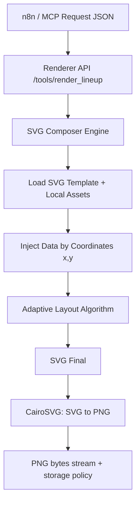
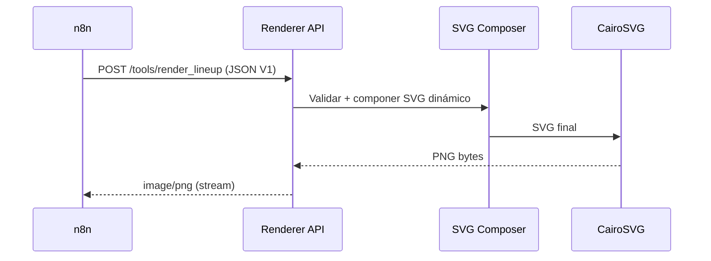

# SDD v2: SVG Renderer (AI LineUp Architect)

## 1. Contexto
Esta especificación define la evolución del renderer en la rama `feature/svg-renderer`.

Se reemplaza el motor V1 basado en HTML + navegador headless (Playwright, SDD §14) por un **Compositor de Imágenes SVG dinámico** con salida PNG determinista.

## 2. Objetivo (§14.b)
Generar carteles **Pixel-Perfect** a partir de plantillas XML/SVG, eliminando dependencias de ejecución de Chromium/Playwright y reduciendo:

- fragilidad en VPS/Docker,
- tiempos de arranque,
- errores por render no determinista del navegador.

## 3. Arquitectura Objetivo



## 4. Especificación del Motor

### 4.1 Librería Principal
- **Primaria:** `CairoSVG` para conversión `SVG -> PNG`.
- **Alternativa técnica (si aplica):** `svglib` + `reportlab` para escenarios de compatibilidad específicos.

Decisión recomendada: mantener CairoSVG como estándar operativo por simplicidad, estabilidad y rendimiento.

### 4.2 Lógica de Composición (Coordenadas Cartesianas)
Cada elemento visual se posiciona por coordenadas absolutas en un canvas fijo `1080x1350`.

- Sistema de referencia: origen en esquina superior izquierda.
- Cada bloque usa:
  - `x`: posición horizontal,
  - `y`: posición vertical,
  - `w/h`: dimensiones de caja,
  - `anchor`: alineación de texto (`start`, `middle`, `end`).

Ejemplo de contrato interno de nodo de texto:

```json
{
  "id": "comic_1",
  "type": "text",
  "x": 620,
  "y": 470,
  "font_family": "BebasNeue",
  "font_size": 78,
  "text_anchor": "start",
  "value": "ADA TORRES"
}
```

### 4.3 Gestión de Fuentes (Obligatoria)
Para evitar fallos de red/CDN:

- uso exclusivo de `.ttf` locales,
- no se permite Google Fonts en runtime,
- fuente objetivo MVP: **Bebas Neue** local.

Ruta obligatoria del MVP:

```text
/root/RECOVA/backend/assets/fonts/BebasNeue.ttf
```

Invariante: si falta la fuente local requerida, el render debe abortar con error estructurado (`ERR_FONT_ASSET_MISSING`).

## 5. Algoritmo de Adaptabilidad

Entrada: `lineup` (array de cómicos) con `n = len(lineup)`.

### 5.1 Reglas Base
- `1 <= n <= 8`.
- **Safe Zone obligatoria del lineup:** `Y=400` (top) a `Y=1100` (bottom).
- El bloque de nombres debe quedar visualmente centrado dentro de esa Safe Zone.

### 5.2 Cálculo de `font_size`
Definición de referencia para V2:

- `font_size_base = 84`.
- Si `n <= 5`: usar `min(font_size_base, max_font_for_slot)`.
- Si `n > 5`: usar reducción proporcional `font_size = font_size_base * (5 / n)`, acotada por `max_font_for_slot`.

Clamping adicional recomendado: `font_size_min = 38`, `font_size_max = 96`.

### 5.3 Cálculo de espaciado y `y_offset`
Variables:

- `safe_zone_top = 400`
- `safe_zone_bottom = 1100`
- `safe_zone_height = safe_zone_bottom - safe_zone_top = 700`
- `slot_height = safe_zone_height / n`

Para cada cómico `i` (0-index):

- `y_center(i) = safe_zone_top + slot_height * (i + 0.5)`

Invariante: `safe_zone_top <= y_center(i) <= safe_zone_bottom` para todo `i`.

### 5.4 Normalización de Texto
- `name`: trim + uppercase para estilo cartel.
- `instagram`: opcional según diseño V2 (si se muestra, en capa separada y tipografía menor).

## 6. Capas del Diseño (Layers)

### Capa 0: Fondo
- Color sólido base.
- Patrón de puntos generado por código (no dependiente de imagen externa).

### Capa 1: Elementos Gráficos
- Ráfagas amarillas.
- Silueta de micrófono (vector embebido o asset local SVG).

### Capa 2: Datos Dinámicos
- Nombres de cómicos (obligatorio).
- Instagrams (si el template activo los requiere).

### Capa 3: Footer
- Fecha del evento (ej. `event.date`).

Orden de pintado invariante: `Layer0 -> Layer1 -> Layer2 -> Layer3`.

## 7. Contrato de API (Compatibilidad Total con V1)

Se mantiene el **mismo JSON de entrada** usado por n8n en la V1. No hay cambios de schema para el orquestador.

Campos de entrada críticos:

- `request_id`
- `event.date`
- `lineup[]` (`order`, `name`, `instagram`)
- `template.template_id`
- `render.*`
- `metadata.*`

Compatibilidad:
- El endpoint `POST /tools/render_lineup` conserva interfaz externa.
- El cambio es interno al motor de composición/render.

## 8. Flujo Operativo



## 9. Errores y Señales

Errores estructurados recomendados:

- `ERR_CONTRACT_INVALID`
- `ERR_FONT_ASSET_MISSING`
- `ERR_SVG_TEMPLATE_NOT_FOUND`
- `ERR_SVG_COMPOSITION_FAILED`
- `ERR_RASTERIZATION_FAILED`

## 10. Riesgos Técnicos

| Riesgo | Impacto | Probabilidad | Mitigación |
|---|---|---:|---|
| Métricas tipográficas inconsistentes entre entornos | Alto | Media | Congelar fuentes `.ttf` locales + tests snapshot por plantilla |
| Overflow de nombres largos | Medio | Alta | Clamping de `font_size`, truncado inteligente y tests de borde |
| Desfase visual por cambios de template | Medio | Media | Versionado de plantilla (`template_id` + `version`) y pruebas golden PNG |
| Falta de fuente local en despliegue | Alto | Baja | Validación de assets en arranque + `ERR_FONT_ASSET_MISSING` |
| Rendimiento en lotes altos | Medio | Media | Pool de workers + cache de template parseado + límites de concurrencia |
| Divergencia con contrato V1 de n8n | Alto | Baja | Test de compatibilidad de payload V1 en CI |

## 11. Criterios de Aceptación
- Render sin dependencia de navegador headless.
- Salida visual consistente (`pixel-perfect`) en `1080x1350`.
- Compatibilidad 100% con payload V1 de n8n.
- Soporte de `lineup` entre 1 y 8 con layout adaptativo estable.
- Entrega de PNG por streaming (`image/png`) desde el endpoint HTTP.
