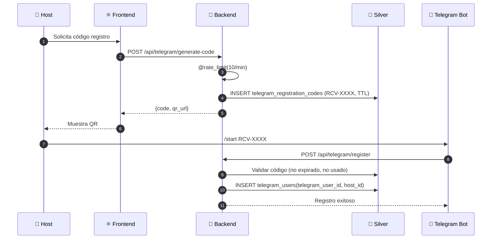
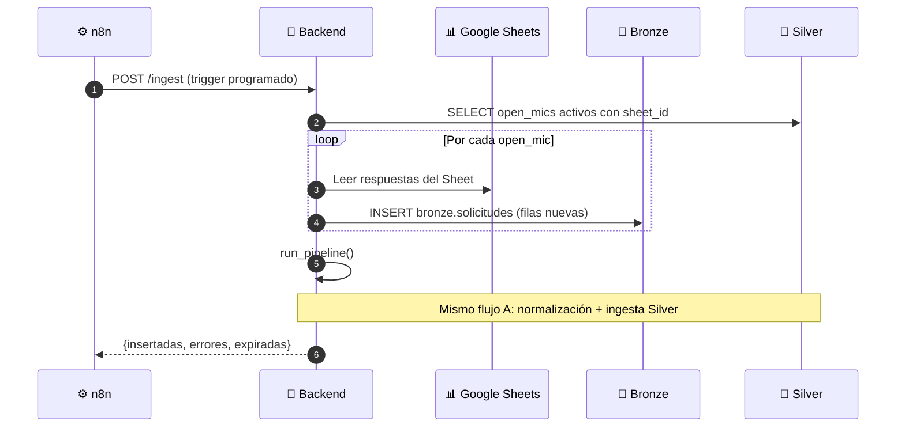
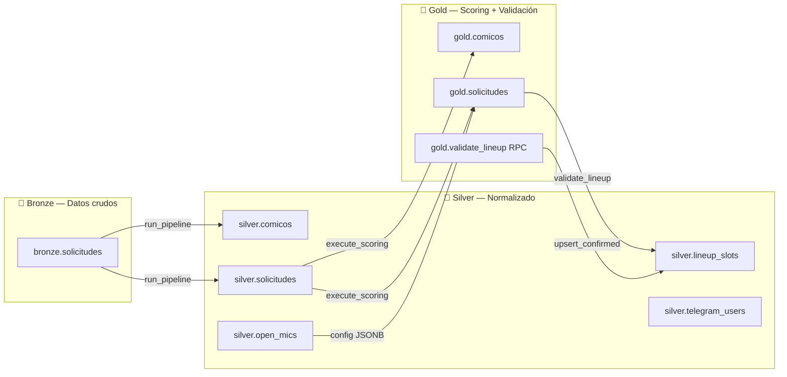

# Diagrama de secuencia — Flujo completo Recova

## Flujo principal: Solicitud → Ingesta → Scoring → Validación

```mermaid
sequenceDiagram
    autonumber
    participant C as 🎤 Cómico
    participant GF as 📋 Google Form
    participant FE as ⚛️ Frontend<br/>(React+Vite)
    participant BE as 🐍 Backend<br/>(Flask)
    participant BZ as 🥉 Bronze
    participant SV as 🥈 Silver
    participant GD as 🥇 Gold
    participant N8 as ⚙️ n8n

    %% === FLOW A: Solicitud + Ingesta ===
    rect rgb(45, 50, 70)
    Note over C, BZ: A — Solicitud e ingesta Bronze → Silver
    C->>GF: Rellena formulario (nombre, fechas, categoría…)
    GF->>BE: Webhook POST /api/form-submission
    BE->>BE: @rate_limit(5/min) + @validate_json
    BE->>BZ: INSERT bronze.solicitudes (datos crudos)
    BE-->>GF: 201 Created

    BE->>BE: run_pipeline() [hilo daemon]
    BE->>BZ: SELECT pendientes (procesado = false)

    loop Por cada solicitud bronze
        BE->>BE: Normalizar teléfono, Instagram, nombre
        BE->>BE: infer_gender() — INE → gender-guesser → genderize.io
        BE->>SV: UPSERT silver.comicos (dedup por Instagram)
        BE->>SV: INSERT silver.solicitudes (1 fila × fecha disponible)
        BE->>BZ: UPDATE procesado = true
    end
    end

    %% === FLOW B: Scoring ===
    rect rgb(50, 55, 45)
    Note over FE, GD: B — Preparación y scoring
    FE->>BE: POST /api/lineup/prepare-validation
    BE->>BE: Autenticar host (organization_members)
    BE->>SV: SELECT open_mics.config (JSONB)
    BE->>BE: execute_scoring(open_mic_id)

    BE->>SV: SELECT silver.solicitudes para este open_mic
    loop build_ranking() por solicitud
        BE->>GD: UPSERT gold.comicos
        BE->>BE: Calcular score (base + bonus fecha única + penalización recencia)
        BE->>BE: Generar score_breakdown JSONB
        BE->>GD: INSERT gold.solicitudes (con score_breakdown)
    end

    BE-->>FE: Top candidatos + token validación
    end

    %% === FLOW C: Validación y confirmación ===
    rect rgb(55, 45, 50)
    Note over FE, N8: C — Validación del lineup
    FE->>FE: Host selecciona 5 candidatos
    FE->>GD: RPC gold.validate_lineup(selection, event_date)
    GD->>GD: UPDATE estado → 'validado'
    GD-->>FE: OK

    FE->>SV: RPC silver.upsert_confirmed_lineup(open_mic_id, fecha, ids)
    SV->>SV: INSERT lineup_slots + UPDATE estado → 'confirmado'
    SV-->>FE: OK

    FE->>N8: Webhook fire-and-forget (lineup confirmado)
    N8->>N8: Notificaciones + generación póster
    end
```



## Flujo secundario: Telegram



## Flujo secundario: Ingesta desde Sheets (batch)



## Arquitectura Medallion — Flujo de datos



## Seguridad por capa

```mermaid
flowchart TD
    REQ[Request entrante] --> RL{@rate_limit}
    RL -->|429| BLOCK[Too Many Requests]
    RL -->|OK| AUTH{@require_api_key}
    AUTH -->|401| DENY[Unauthorized]
    AUTH -->|OK| VAL{@validate_json}
    VAL -->|400| BAD[Bad Request]
    VAL -->|OK| HANDLER[Lógica del endpoint]
    HANDLER --> SQL{SQL seguro}
    SQL -->|whitelist + sql.Identifier| DB[(Supabase)]
```
